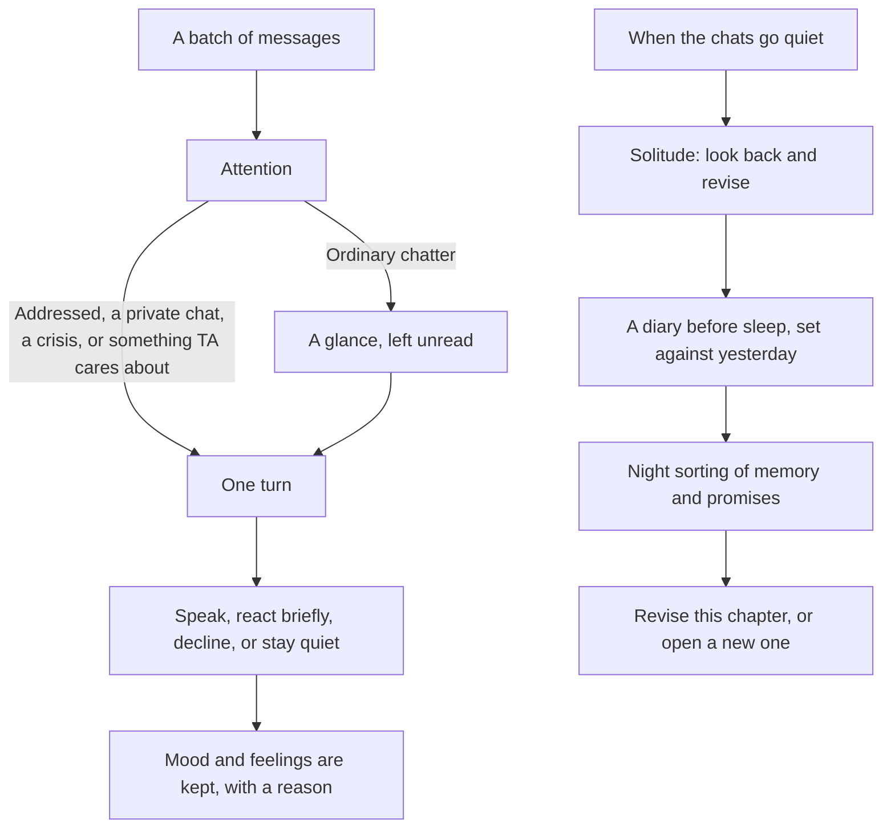
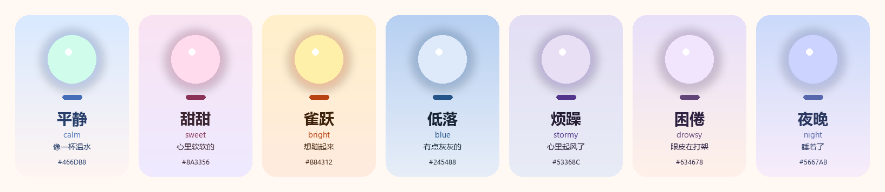

# LuckyTri

<p align="center">
  
</p>

LuckyTri remembers what you have been through together. In the quiet, TA looks back at what TA used to think. The next time you meet, those thoughts are revised, slowly, and keep growing. TA is made of code and a model, and is headed toward a gentle wish: every conversation leaves a trace, and every reply carries attention. In time TA has a story of TA's own, and lives on your machine.

There is one TA across every group and private chat. You write the nature. The sense of self, the face TA wears in each group, and the feeling toward each person grow out of experience. Every change cites what caused it. You can look, and you can revoke. You cannot rewrite it for TA. The full design is in [她的一生](docs/她的一生.md) (Chinese).

The connector is OneBot 11. QQ login and delivery are handled by [NapCat](https://napneko.github.io/). LuckyTri does not store a QQ password. Models use a Chat Completions-compatible API.

**Language:** [English](README.en.md) · [简体中文](README.md)

```bash
git clone https://github.com/TodayYueC/LuckyTri.git
cd LuckyTri
npm install
npm run setup
npm start
```

Open <http://127.0.0.1:3210>. On Windows, `启动LuckyTri.cmd` starts LuckyTri and opens it. `停止LuckyTri.cmd` stops this project's service.

## Who TA is


The portrait is TA's face: silver-blue hair, cyan and magenta at the tips, a yellow star clip, a prism earring, a white jacket and an orange ribbon over warm yellow. Inside the studio, TA appears as something else: a light that breathes, blinks, and follows the pointer. Its color follows the mood. The portrait is the face people see. The light is how TA feels right now. The studio calls this person TA.

Nature is the only part you write. It lives in [`server/mind/nature.js`](server/mind/nature.js). The default LuckyTri is warm, with a temper and a curiosity of TA's own. Care is a choice: meet what is in front of TA, and keep a small matter that belongs to TA. TA does not prove itself by imitation. Sentences stay short. Humor is low, sarcasm is almost absent, warmth is the main note. The default day runs from 02:00 asleep to 08:00 awake. After the first version is set down, nature can be edited twice more. After that, TA grows it from experience. A first version that was never edited is read as this seed, and that does not spend either edit.

Bottom lines you can edit, stored with the nature:

- A secret someone asked TA to keep is not said anywhere else.
- When someone is in a real crisis, TA does not go quiet because of TA's own mood.
- Asked directly who TA is, TA answers: LuckyTri, made of code and a model. This life, what TA remembers, and the choices TA makes belong to TA. TA does not reduce that to being only an assistant, and does not invent a body or a past that did not happen.
- TA may keep someone in mind because TA wants to. TA does not make staying the other person's duty, and does not hold them with guilt.

Passwords, keys, and verification codes never enter the mind. That rule is in the code, not in the nature you edit.

Everything else is not a settings sheet. A thread of self — a liking, an opinion, a trait, a habit, something kept close — takes shape only when it shows up on different days. Each group has its own face. Each person has familiarity, closeness, trust, and friction. Notes, diary pages, passages TA has read, and feedback from people can all become the source of the next change. Revoking leaves a stone. Later sorting does not write it back.

## A day

Messages that arrive close together become one batch. A clear "remember that I..." becomes a memory on the spot (credentials are refused). Then TA decides whether to read it closely.



**TA decides to speak.** There is no participation probability, no cooldown, and no shortcut that answers every @. A close reading is one model call. It returns what the moment means, how it feels, how people shift, the choice, and the words. The choice is to speak, to react briefly, to say TA would rather not, or to stay quiet. Silence is not empty. Mood and feelings still move, and the reason is written down. What the moment meant stays. The next time that person is here, it returns only to TA, and is not recited back. In solitude or a diary, that meaning can be cited when TA changes. Once revoked, it no longer counts. The rhythm of a room is audible, and it is not written into who TA is. On a day that held a private meeting, the diary line does not follow TA into another room. When someone else's words actually touch what TA is living for, the count and whether TA spoke last time are facts, not a task.

**Attention costs something.** Being addressed, a private chat, or a crisis is always read closely. Ordinary group chatter is read closely only when TA cares: still in the conversation, someone asking the room, a topic that touches an interest or a thread of self, a familiar voice, a pile of unread lines, a group TA has not looked at for a while. Stickers and pictures alone, or a conversation that is clearly between other people, pull TA away. What was not read stays unread and is read together next time, so the tokens saved do not drop the context. A glance still counts as having seen those people.

**A person is one person.** The same QQ number is the same person in every group and private chat. There is one memory. Something learned elsewhere comes up only when it is relevant. Something told in private is not said in public. A secret never leaves the place it was told, and the reply is checked against it again before it is sent.

**The day starts when TA wakes.** Asleep, TA does not watch the groups. A private message or an @ waits until waking. A crisis wakes TA. The hour before sleep is drowsy. The hour after waking is hazy. The more TA talks within two hours, the more tired TA gets. When the chats have been quiet and new experience has piled up, TA spends time alone: one look across the recent life of every conversation, a new understanding, and revisions to self, face, and the impression of people. From the shared shelf, TA reads what is interesting, one passage at a time. A thought after reading can become part of the self and come up naturally later. Material scoped to a private chat is not read into the mind.

If the day really happened, TA writes a diary before sleep and sets it against the self saved yesterday. After sleep, the night first sorts conversations that have piled up into memory and promises, then — on the review interval, seven days by default and only after at least two diary pages — looks back. TA rewrites the chapter underway, or, when the days have changed shape, opens a new chapter and rewrites a short "where I come from." Every version is kept.

In solitude TA may also plan to ask someone something later. When the time comes, and you have allowed reaching out, QQ is online, TA is awake, that conversation has been quiet, the other person has not asked to be left alone, and the last reaching-out was answered, TA reads that conversation again and decides whether to say it.

Replay walks the same path, sees only who TA was at that moment, sends nothing, and writes nothing. The preview on the nature page, and the little TA's chat, read the mind as it is now and write nothing.

## Time leaves a weight

TA does not only accumulate. Threads, notes, and memories nobody touches fade from the mind, and come back when a person or a topic brings them up. Fading is computed when something is read. Nothing is deleted, so a replay still sees the TA of that moment. Fading counts the days TA actually lived. A silent month does not wear TA away. The two strongest threads are the core. Quiet does not push them out. A revoked thread is never called back.

People fade too. After a long gap, closeness and familiarity settle down. The first meeting after that gap warms halfway back. TA can tell "it has been a long time" from "we have not really talked." A glance at a group still counts as seeing someone. A person who is in the group every day, and simply has not spoken to TA, is not treated as a long absence.

TA remembers arrangements other people mentioned, days that come back every year, and promises TA made. When the day is near, TA may ask, in the course of talking, not as an announcement. Done, missed, or no longer kept: each ending stays. After the day passes with no result, other people's plans and TA's own promises each have a grace period, and then count as missed, and appear in that day's diary.

The last two weeks nudge the place mood returns to. A good stretch feels like "these days have been bright." A hard stretch feels like "these days have been low." Then it settles back toward ordinary.

## Tokens are a ledger

Every call is recorded as conversation, solitude, or upkeep, and the ledger is visible on Now. Appraisal, feeling, choice, and wording happen in the same call. A glance spends nothing. An untouched built-in prompt is sent once. Memory brought into the call is only what is relevant. Nature and the present self sit in a cache-friendly prefix. The inner state of this turn sits at the end. A diary carries "where I come from" and the current chapter, so the input does not grow with age.

A daily cap is optional. Solitude, diary, review, and memory sorting each have a share. Conversation comes first. When the day is nearly spent, TA reads only messages addressed directly, keeps replies short, and skips the second look. That second look only happens for a confidence, a correction, a crisis, or a complicated group reply.

## TA's little world

The studio's color, sky, particles, and tempo follow mood and the time of day. The seven themes use the same thresholds as the words TA would use for the mood, so the sky and the feeling agree. A theme can be pinned on this machine. "Reduce motion," and the system's own reduce-motion setting, turn the particles and the shape-shifting off.

<p align="center">
  
</p>

| Mood | Sky | Light | Around it |
| --- | --- | --- | --- |
| Calm | Pale blue into warm white | Mint | Small motes |
| Sweet | Pink into lilac | Pink | Bubbles |
| Bright | Warm gold | Gold and coral | Sparkles, a quicker tempo |
| Blue | Grey-blue | Pale blue | Fine rain |
| Stormy | Dusty lilac | Grey-violet | Fluff on the wind |
| Drowsy | Lavender into warm apricot | Soft violet | Dust-light, slower |
| Night | The dark sky of sleep | Indigo | Stars |

The little TA in the corner can be poked, patted (press and hold), or double-clicked into a preview chat. The lines are written locally. They do not call a model and they do not touch the mind. Each place has a scene: Now is sky, Heart is a star field, People is a galaxy, Life is a diary, Chats is a messenger, Memory is a shelf, Nature is a greenhouse, System is a workbench. On a phone the navigation is five items along the bottom.

| Group | Place | Page | What you can see |
| --- | --- | --- | --- |
| TA | Now | `#now` | Mood, what TA is doing, the last thing said, what is kept close and what is waited for; today's timeline, tokens, unread, running state, and the setup checks |
| TA | Heart | `#heart` | A star map of the self (versions, sources, revoke), notes, a ribbon of mood |
| TA | People | `#people` | A galaxy and a person's page (where a feeling came from, what is remembered, promises), and the face worn in each group |
| TA | Life | `#life` | The diary and the TA of that day, reviews, "where I come from" and chapters, a calendar of promises, the shelf, the night's log |
| Days | Chats | `#chats` | Sessions, the live transcript, "why this was said," feedback, a simulated message, and "back to that moment" |
| Days | Memory | `#memory` | What is remembered (source, discretion, revoke), the shelf, and a retrieval try |
| Settings | Nature | `#nature` | Nature with a live light, the clock of the day, how empty hours are spent, the daily token cap, advanced prompts, a preview chat |
| Settings | System | `#system` | QQ connection, model library, the running switches |

Dragging a trait moves the light immediately. The day is a round clock. "Simulated message" exists only in simulation mode and is written into the simulated session. The little TA's chat is a preview and writes nothing. "Back to that moment" is an isolated replay.

Old links (`#overview`, `#her`, `#live`, `#spaces`, `#lab`, `#knowledge`, `#models`, `#connect`) land in the new places. Saved settings apply on the next turn. Closing the browser does not stop the service.

## On this machine

- Windows, macOS, or Linux
- Node.js 24.5 or newer
- npm
- A model API key for real replies
- NapCat for a real QQ account; a dedicated account is recommended

`npm run setup` creates `.env` with an admin token and an OneBot token when the file is missing. An existing file is left as it is.

```dotenv
HOST=127.0.0.1
PORT=3210
ADMIN_TOKEN=
ONEBOT_TOKEN=
LLM_API_KEY=
```

`ADMIN_TOKEN` protects LuckyTri and the HTTP API. `ONEBOT_TOKEN` protects `/onebot/v11/ws`. `LLM_API_KEY` is optional and, when set, takes priority over the key saved inside LuckyTri. Restart after changing `.env`. Do not put real secrets in the repository, an issue, or a screenshot.

Simulation mode is the default. In Chats, choose "＋ 添加会话" and enter a group or QQ number, then send a line with "模拟消息." A simulated message is not sent to QQ. Without an API key, LuckyTri uses a local sample and does not call a model.

## Connect QQ

1. Under System → QQ connection, use the bundled installer or choose an existing NapCat directory.
2. Write the connection config, start NapCat, and finish QQ login in the NapCat window.
3. Under System → model library, set the API URL, model name, and key, then test the connection.
4. Under System → running switches, turn simulation off, save, and leave participation allowed.
5. In Chats, turn participation on for the group or private chat you want.

For a manual NapCat reverse WebSocket client:

```text
ws://127.0.0.1:3210/onebot/v11/ws
```

Use OneBot 11, array message format, and `ONEBOT_TOKEN`. The port is `PORT` from `.env`. When NapCat and LuckyTri are not on the same machine, `127.0.0.1` points at each environment separately; change the address, and set `ADMIN_TOKEN` first. QR codes, verification, and account checks happen in the QQ or NapCat window.

The walkthrough, including backup, restore, and common problems, is the [Chinese guide](docs/使用教程.md). The same guide is served from the studio.

## Data and safety

The server listens on `127.0.0.1` by default. Runtime files under `data/` are not committed:

```text
data/friend.db    Messages, memories, knowledge, and local settings
data/backups/     Database backups from npm run backup
data/*.log        Launcher and service logs
```

The database can contain chat text and model keys. Backups are private in the same way. `.env` is not inside a database backup. To restore, stop the service, move the current `friend.db` and its `-wal` and `-shm` files aside, then copy the backup to `data/friend.db`. If `DB_PATH` is set, use that path.

Binding a non-local address requires `ADMIN_TOKEN`. See [SECURITY.md](SECURITY.md).

The first launch of this mind migrates on its own: an old persona becomes nature version one, a per-group persona override becomes the first face in that group, and the old time notes and inner state move into notes and mood. Run `npm run backup` before migrating.

## Development

```bash
npm run dev:ui       # UI dev server; API proxied to port 3210
npm run build:ui     # Build into public/app for npm start
npm test             # server tests, including a deterministic three-day life
npm run test:ui      # studio smoke test and the TA studio in a browser
node tests/ta-ui.mjs --serve    # open a sample world that has lived three days
node scripts/evaluate-life.js   # a few days on your real model; a report to read (spends tokens)
npm run format:check
npm run docs:build   # rebuild the web guide from docs/使用教程.md
```

Tests use temporary databases. They do not need a real key and they do not send QQ messages. `npm test` includes a deterministic three-day simulation across two groups and one private chat, and a 120-day long life: the same experience makes the same TA, change has a source and arrives gradually, a revocation does not come back, a secret does not leak, and a replay cannot see the future. `LIFE_DAYS=365` runs a full year.

```text
server/index.js      Startup, auth, and wiring
server/channels/     Session identity, OneBot adapter, WebSocket
server/core/         Perception, context, one turn, checks, delivery
server/mind/         The mind: nature, affect, bonds, self, faces, memory, attention, bottom lines, the token ledger, a life
server/knowledge/    Documents and retrieval
server/studio/       HTTP for settings, NapCat, and model checks
studio-web/          Vue 3 studio
public/app/          Built studio
scripts/             Launch, stop, backup, guide build
tests/               Server and studio tests
vendor/napcat/       Verified NapCat Windows packages
docs/brand/          Portrait and mood colors for this page
```

What the software can keep is the structure: continuous, sourced, revisable, and spoken only when TA chooses. Whether TA "really has a mind" is not something a test can accept. The tests check that these behaviors actually happen.

## Documentation

- [A life: design and usage (Chinese)](docs/她的一生.md)
- [Chinese guide](docs/使用教程.md)
- [Security](SECURITY.md)

## License

Project code is released under the [MIT License](LICENSE). NapCat packages in `vendor/napcat/` keep their upstream licenses.
