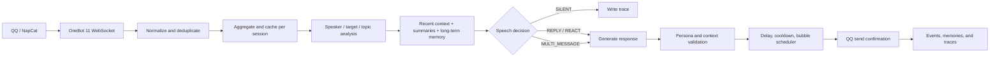

# Lucky · QQ AI Companion

[](https://nodejs.org/)
[](LICENSE)
[](https://onebot.adapters.nonebot.dev/)
[](#installation)

**Language / 语言:** [English (current)](README.en.md) · [简体中文](README.md)

> **中文简介：** 让一个 AI 学会在群里理解人、记得事，也知道什么时候闭嘴。<br>
> **English:** *A local-first AI companion that understands people, remembers what matters, and knows when to stay quiet.*

Lucky is a local-first AI companion for QQ groups and private chats. It receives messages through a OneBot 11-compatible bridge and separates **whether to speak** from **what to say**. Conversation context, reply targets, long-term memory, persona controls, and delivery pacing are explicit parts of the system.

The goal is not to answer every message. Lucky should be able to live in a group for a long time: understand who is talking to whom, remember meaningful details, join at the right moment, and remain quiet when an exchange is clearly between other people.

## Highlights

| Capability | What it does |
| --- | --- |
| Multi-person context | Stores message IDs, speakers, timestamps, mentions, quotes, attachments, and topics instead of flattening a group into one prompt. |
| Independent speech decision | Uses `SILENT`, `REPLY`, `REACT`, and `MULTI_MESSAGE` paths. Direct mentions, name calls, private chats, and natural continuations receive priority. |
| Short aggregation window | Groups a burst of messages before reasoning so a follow-up from another member is not missed. |
| Three-layer memory | Keeps recent raw context, stage summaries, and durable facts with source, scope, confidence, importance, version, and lock state. |
| Memory boundaries | Shared memories can follow a QQ user across sessions; private-only and session-only memories stay isolated. |
| Stable persona | Separates identity, interests, forbidden expressions, warmth, humor, activity, initiative, and sarcasm controls. Natural conversation has priority over persona performance. |
| Human-like pacing | Adds delivery delay, cooldown, and global rate limits. Multiple message bubbles are supported when they are natural, without mechanically splitting every sentence. |
| Images and stickers | Keeps an image with its surrounding text and distinguishes ordinary images, QQ stickers, and marketplace stickers. |
| Model profiles | Supports DeepSeek, MiMo, OpenAI-compatible APIs, Qwen, Kimi, Zhipu, SiliconFlow, OpenRouter, and custom providers. |
| Debugging and replay | Shows final context, retrieved memories, decision reasons, usage, raw model output, timing, and bubble splitting; historical messages can be replayed in isolation. |
| Local WebUI | Manage models, sessions, persona, prompts, memories, QQ setup, diagnostics, and replay from one interface. |

## Architecture



The core pipeline lives in `server/core/` and is intentionally modular:

| Module | Responsibility |
| --- | --- |
| `message-manager` | Normalize QQ messages, deduplicate events, and preserve attachments and quotes |
| `conversation-manager` | Per-session watermarks, recent context, and aggregation windows |
| `context-builder` | Assemble full context, persona, and relevant memories |
| `topic-tracker` | Track topics, stage summaries, and evidence |
| `reply-target-resolver` | Resolve who a message is addressed to and whether it follows Lucky |
| `speech-decision` | Decide whether to speak and which response path to use |
| `persona-manager` | Compile persona controls and prompts |
| `memory-manager` | Candidate extraction, review, merge, versioning, scope, and expiry |
| `vision-manager` | Send images together with their owning messages |
| `response-generator` | Generate one or more natural message bubbles |
| `response-validator` | Catch wrong targets, repetition, lectures, hostility, and AI-like templates |
| `message-scheduler` | Delivery delay, cooldown, global rate limits, and send confirmation |
| `model-manager` | Provider-specific parameters, budgets, reasoning modes, and usage records |

## Installation

### Requirements

- Windows, macOS, or Linux
- Node.js 24 or newer
- `npm`
- A Chat Completions-compatible model API for real replies
- [NapCatQQ](https://napneko.github.io/) for a real QQ connection; a dedicated QQ account is recommended

### Start the local studio

```bash
git clone https://github.com/TodayYueC/lucky-qq-ai-friend.git
cd lucky-qq-ai-friend
npm install
npm start
```

Open <http://127.0.0.1:3210>. On Windows, you can also double-click:

- `启动Lucky.cmd` to start the service and open the studio.
- `停止Lucky.cmd` to stop the project service.

Start in simulation mode first. Add a group or QQ number in “Sessions” and verify decisions, memory, and persona behavior before connecting a real account. Simulation does not call a model or send QQ messages.

### Local credentials

Copy `.env.example` to `.env` and use separate, random, long tokens for the management UI and OneBot bridge:

```dotenv
HOST=127.0.0.1
PORT=3210
ADMIN_TOKEN=replace-with-a-long-random-token
ONEBOT_TOKEN=replace-with-a-different-long-random-token
LLM_API_KEY=
```

Model credentials can also be saved in the WebUI. **Never put real keys in the README, issues, screenshots, fixtures, or Git history.** `.env`, `data/`, SQLite databases, and logs are ignored by Git.

## Connect QQ

1. Install and log in to [NapCatQQ](https://napneko.github.io/) with a dedicated QQ account.
2. In Lucky’s “QQ Setup Assistant”, select the NapCat directory, generate the OneBot configuration, and launch NapCat. You can also configure the reverse WebSocket manually:

   ```text
   ws://127.0.0.1:3210/onebot/v11/ws
   ```

3. In “Model Management”, enter the provider, API URL, model ID, and API key, then run the connection test.
4. Disable simulation mode in “Connection & Settings” and save.
5. Enable the group or private session in “Sessions”.
6. Mention the account or call it `Lucky` in QQ to test the connection.

QQ passwords, QR codes, verification codes, and security confirmations remain inside QQ/NapCat. Lucky never stores a QQ password. NapCat is an independent third-party component; follow its license and QQ platform rules.

The repository includes verified NapCat Windows packages. Their sources and SHA-256 values are recorded in `vendor/napcat/manifest.json` and `vendor/napcat/shell-manifest.json`.

## WebUI areas

- **Overview**: connection status, mode, active sessions, model profiles, and recent decisions.
- **Sessions**: add/archive sessions, enable or pause participation, set probability, cooldown, aggregation, context length, and per-group persona overrides.
- **Model Management**: multiple providers, context/input/output budgets, vision, reasoning effort, connection tests, and profile deletion.
- **Persona & Rhythm**: identity, interests, forbidden expressions, reply length, warmth, humor, activity, initiative, sarcasm, and isolated chat previews.
- **Memory Garden**: search, edit, lock, delete, review candidates, change scope, confidence, and importance.
- **Prompt Management**: separate System, Decision, Generation, Memory, Vision, and Validation prompts.
- **Debugging**: received messages, resolved targets, full context, retrieved memories, decision reasons, usage, raw output, and timings.
- **Replay**: replay a historical range with the current configuration in isolation; it does not send QQ or write production memory.

## Privacy and security

Lucky listens on `127.0.0.1` by default. Runtime data is stored locally under `data/`:

```text
data/friend.db       SQLite database with messages, memories, and local settings
data/backups/        Consistent database backups
data/*.log           Launcher, service, and error logs
```

These files are not part of the repository. The database may contain chat history, long-term memories, and model credentials, so protect local file access. Before exposing the studio to another machine, set a strong `ADMIN_TOKEN` and use a trusted HTTPS/WSS reverse proxy.

If a key ever reaches Git history, revoke it with the provider first and then rewrite the history. Deleting the current file alone is not enough. See [SECURITY.md](SECURITY.md).

## Development and tests

```bash
npm test                 # Unit, HTTP, and OneBot integration tests
npm run test:ui          # Playwright browser smoke tests
npm run format:check     # Prettier check
npm run docs:build       # Rebuild the web tutorial
```

Tests use temporary databases and simulated models. They do not need a real API key and do not send QQ messages. The current suite contains 110 tests covering message ownership, reply chains, memory isolation, probability and cooldown, images/stickers, malformed model output, NapCat setup, model parameters, and UI flows.

## Repository layout

```text
server/                 Server, OneBot bridge, SQLite, and orchestration
server/core/            Message, context, memory, decision, and model modules
public/                 Vanilla JavaScript/CSS WebUI
scripts/                Launch, stop, backup, docs, and evaluation scripts
tests/                  Unit, integration, OneBot, and UI tests
docs/                   Tutorials, design notes, style, and performance notes
vendor/napcat/          Verified NapCat Windows packages
data/                   Local runtime data; never committed
```

## Documentation

- [Chinese setup guide](docs/使用教程.md)
- [System redesign](docs/系统重构设计-v1.md)
- [Acceptance checklist](docs/重构版使用与验收.md)
- [Conversation style](docs/chat-style.md)
- [MiMo performance notes](docs/MiMo性能排查.md)
- [Security policy](SECURITY.md)

## Scope and roadmap

The current release targets one process and one QQ account. Relationship inference, automatic promotion of durable facts, proactive topics, sticker selection, and additional vision tools have extension points but are not enabled by default. Availability of QQ, NapCat, and model providers remains subject to their own policies and account-safety controls.

## License

The project code is released under the [MIT License](LICENSE). The NapCatQQ packages under `vendor/napcat/` and their dependencies remain subject to their respective upstream licenses.

Issues and pull requests are welcome.
