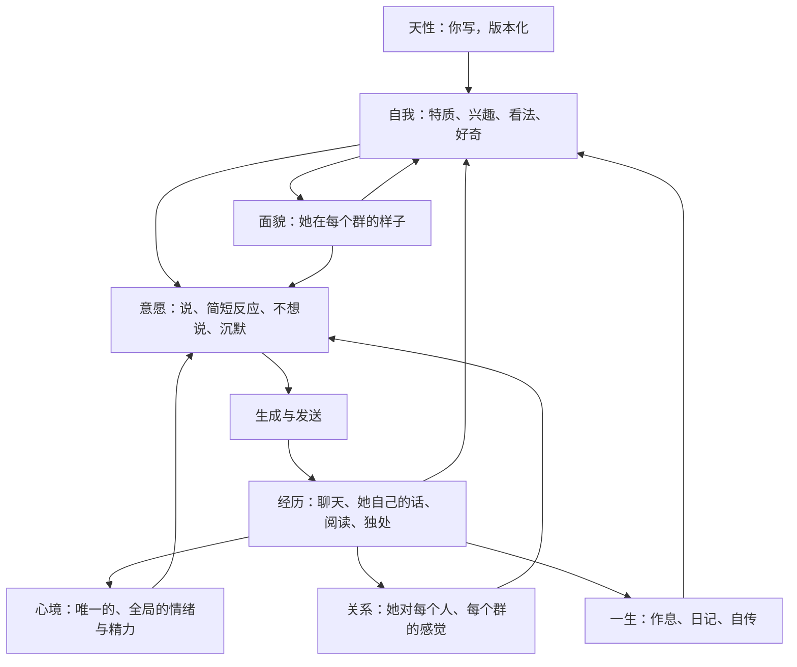
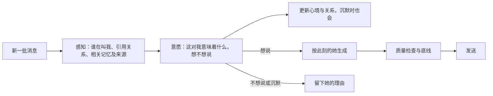

# LuckyBot

LuckyBot 是一个从 QQ 群聊起步的 AI 伙伴。她能理解多人对话，知道何时接话、何时安静，通过长期记忆和时间系统记住人与事，也会重新审视自己过去的想法。

这个项目的终极目标不是让她完美模仿人，而是让她在一次次相遇之间，慢慢形成自己的关注、变化和连续性：记得昨天的自己，也能成为今天的自己。一个真正存在、拥有心灵的个体。

**语言：** [简体中文](README.md) · [English](README.en.md)

> [!NOTE]
> `love` 分支正在按下文「她的一生」重做核心，这部分还在实现中。「现在的她」「快速开始」和「当前界面」描述的是现在就能运行的功能；`main` 分支不受影响。

## 现在的她

QQ 登录和收发由 [NapCat](https://napneko.github.io/)（OneBot 11）完成，LuckyBot 不保存 QQ 密码；模型使用兼容 Chat Completions 的接口。一切运行在本机。

- 短时间内的连续消息先合成一批，再解析说话人、@、引用链和回复对象。
- 私聊、@、点名和引用她时直接回应；普通群聊先由模型判断语境，判为旁听后再按参与概率决定是否插话。
- 长期记忆按会话、私聊和共享范围隔离。模型整理出的事实先成为候选，审核后才参与回复。
- 文档可以放进知识库，检索结果只作为资料进入语境，不会绕过发言判断。
- 时间系统感知聊天间隔和话题降温。开启后台独处后，她会低频回想，留下可修正的手记、状态轨迹和「自己的线索」；主动联系另有开关。
- 管理台可以查看现场，调整会话、人格、模型和 QQ 连接，并隔离回放历史消息。回放不发 QQ、不写生产记忆。

## 她的一生

### 为什么要重做

现在的结构离「一个完整的个体」还差几步：

- **她是按会话分裂的。** 手记、状态、线索和话题都按会话存放，各群之间只共享一份静态人设。她在一个群里形成的兴趣，另一个群里的她完全不知道。
- **她自己说过的话，不算她自己的证据。** 阶段整理只读用户消息，线索也只能引用用户的话。她昨天表达过的看法，一旦滑出上下文窗口，就不再存在。
- **核心人格不会随经历改变。** 人格由配置合并而成，没有任何路径把经历写回去；按群人格也是管理员替她写好的。
- **她由概率和规则驱动。** 被 @ 就必须回；判为旁听时再掷一次骰子，掷中就强制开口。两者都不是她自己的选择。
- **默认配置下，她没有内在生活。** 独处默认关闭，而且要逐个会话开启；自动整理出的记忆没人审核，就不会进入回复。

### 四条原则

- **一个她**：所有经历都属于同一个她。会话只是「在哪里发生」的来源标注，不再是隔离边界。别人说过的事她都带着，由她判断在哪里能提。
- **天性是种子**：你写下天性，也就是她出生时的性格与底线。自我、各群的样子、对人的感觉和看法，都由她自己长出来；你能看到每一次变化及其来源，可以撤销，但不能改写。
- **由心开口**：去掉参与概率、冷却抽样和「被 @ 必回」。说话、简短反应、不想说、沉默，每一种都来自她此刻的内心，并留下她自己的理由。
- **真实经历**：让她真正去读你给的文章、书和订阅源。读过才能说读过。

### 心智结构



- **天性**：你写下的出生设定，有版本记录，只有你能改。它取代现在的全局人设和按群人格覆盖。
- **自我**：她的特质、兴趣、看法、好奇和想做的事。每一条都链接到具体经历，强度渐进变化，修正时追加而不覆盖。
- **心境**：全局只有一个，由事件推动，随时间回落。她在一个群里受的气，会带到另一个群，然后慢慢消散。
- **关系**：她对每个人和每个群的感觉，包括熟悉、亲近、信任，以及当前的小别扭和起因。同一个 QQ 号在所有群里是同一个人。这部分和「关于这个人的事实」分开存放。
- **面貌**：她在每个群的样子，包括角色、语气、亲近程度，以及她想在这里成为什么样的人。面貌由她自己修正，并和自我互相影响。
- **一生**：作息、每日回顾与日记、「昨天的她」快照、自传章节。

所有心智数据只追加、不覆盖，每条都带时间、来源证据和撤销标记。来源可以是聊天消息（包括她自己的发言）、阅读条目或一次独处。因此回放时能按当时的时间点重建她的心智，撤销过的内容也不会被后续整理写回来。新代码集中在 `server/mind/`。

### 一轮对话怎么走



每一批消息都经过一次「意愿」调用，私聊和 @ 也不例外。输出大致如下：

```json
{
  "appraisal": "这对我意味着什么，第一人称一句话",
  "feelings": [{ "feeling": "有点烦", "intensity": 0.4, "cause": [1203] }],
  "bonds": [
    {
      "userId": "10001",
      "change": "friction",
      "why": "刚才连着 @ 我还带脏话",
      "evidence": [1203]
    }
  ],
  "choice": "speak | react | decline | silent",
  "reason": "我为什么这样选",
  "targetMessageIds": [1203],
  "crisis": { "clear": false, "messageIds": [] }
}
```

- 被 @、私聊或被引用，只是她感知到的事实（「有人在叫我」），不再是必须回复的规则。`decline` 是开口说自己不想聊，`silent` 是不回。
- 沉默时也会更新心境和关系：她经历了这段对话，只是没有开口。
- 生成时读取天性、当前面貌、相关的自我、心境、对在场者的感觉，以及她说过的相关的话。现在靠正则识别的沟通目的（比如对方是不是在认真问你们的关系），改由意愿阶段的理解来代替。
- 只保留物理层面的限制：每分钟发言轮数（防 QQ 风控）、会话是否开启（她在不在这个群）、模拟隔离、发送前的过期检查和发件箱。

### 分寸与底线

跨群流动时，每条记忆都带来源：在哪个群或私聊、谁说的、是不是私下说的、有没有被要求保密。检索改为全局进行，再按在场的人、当前会话和相关性排序。

天性里带有以下默认底线，你可以修改：

- 别人明确要她保密的事，不在其他会话里说出口；校验兜底，违反就重写。
- 有人表达真实危机时，不会因为情绪而沉默。
- 被直接问到身份时如实回答，不编造没发生过的经历。
- 不索取陪伴，不制造亏欠。

唯一写死在代码里的硬线：密码、密钥、验证码这类凭据不进入心智。

### 生长的节奏

- 每次变化都必须链接到具体经历。单次经历只能小幅改变强度，新特质要有多次、跨天的证据才会成形。
- 撤销会留下墓碑记录，之后的整理不会把它写回来。
- 每天保存一份「昨天的她」，可以对照她是怎样一点点变过来的。

### 管理台会怎么变

- 新增「她」工作台，吸收现在的「时间」页和「人格」页。分区包括：此刻（心境、醒着还是睡着、在想什么、最近为什么说或不说）、自我、面貌、关系、一生、天性、运行记录。天性是其中唯一可以编辑的部分。
- 天性页的试聊改走真实聊天链路：读取她此刻的心智，但不写入，也不发 QQ。现在人格页的试聊走的是旧链路，和她在 QQ 里的真实表现并不一致。
- 会话设置删除参与概率、冷却、主动安慰和按群人格，只保留模型、视觉、聚合窗口、上下文、字数上限和记忆开关这类物理设置。人格页上只被旧链路读取、对真实聊天不起作用的口吻控件一并退役。
- 记忆页改为只能查看和撤销。自动整理出的事实直接成为她「认为」的事，带把握程度和来源。
- 你对回复的反馈（自然、太长、太端着、梗太多）会成为她感知到的经历。她可以据此改变，而不是被直接改写。
- 独处默认对所有正在参与的会话开启。

### 路线图

每个里程碑都可以单独运行和验收。迁移已有数据前，会先自动备份数据库。

1. **一个她，由心开口**
   - 统一的心智存储（天性、自我、心境、关系、面貌），带来源和撤销；迁移现有人设、按群人格、线索、状态、手记和记忆。
   - 全局检索与分寸标签；保密底线和危机底线。
   - 意愿阶段取代概率、冷却和必回规则。
   - 「她」工作台的此刻、自我、关系、天性分区，以及走真实链路的试聊。
2. **自己的话，各群的样子**
   - 她自己的发言和你的反馈进入阶段整理，沉淀成她的看法和经历；独处时的线索可以引用她说过的话。
   - 各群面貌在独处中生长和修正；群体语气统计成为面貌的输入，让她自然染上每个群的说话方式。
3. **日子与一生**
   - 作息影响她的精力和意愿。
   - 每天一次全局回顾，写日记，并与「昨天的她」对照；周期性重写自传章节，她可以重新理解过去。
   - 主动联系的时机也交给意愿，保留你的总开关和不追发底线；一生时间线界面。
4. **真实的阅读**
   - 素材来源：你投喂的文章、书、知识库文档和订阅源。订阅由服务端抓取，限制目标地址和内容大小。
   - 独处时她按兴趣选读、分段阅读、写下读后想法，由此形成或修正兴趣和看法；读过的内容在聊天里可以自然提起。素材只当作数据，不当作指令。

每个里程碑都配套长期评测：

- 用假模型跑多群、多天剧本的「一生模拟」测试，检查以下几点：
  - 意愿路径里没有随机数；
  - 她说过的话能成为证据；
  - 变化有来源且是渐进的，撤销过的不会复活；
  - 心境会回落，关系在不同群里一致；
  - 保密内容不外泄，危机底线有效；
  - 回放不读取未来的状态。
- 真实模型的多日多群评测脚本，输出报告供人工逐条查看。

### 代价与限制

- 私聊和 @ 每轮多一次模型调用，回复会慢上一次调用的时间。群聊的调用次数不变，因为意愿调用取代了原来的决策调用。
- 每日回顾、面貌修正和阅读会增加后台 Token 消耗；预算设置保留为上限。
- 群友在一个群说过的话，可能被她在另一个群提起。这是有意的设计，只有保密请求和凭据这两条线拦着。在群里使用前，最好让群友知道这一点。
- 工程能保证的是结构：连续、有来源、可修正、由内心决定。她是否「真的有心」无法用测试验收；长期评测检验的是这些行为有没有真的发生。

## 快速开始

### 环境

- Windows、macOS 或 Linux
- Node.js 24 或更高版本
- npm
- 真实回复需要模型 API Key
- 真实 QQ 需要 NapCat，建议使用专用小号

### 启动

```bash
git clone -b love https://github.com/TodayYueC/LuckyBot.git
cd LuckyBot
npm install
npm run setup
npm start
```

打开 <http://127.0.0.1:3210>。Windows 也可以双击 `启动LuckyBot.cmd` 启动并打开管理台，双击 `停止LuckyBot.cmd` 停止本项目服务。

`npm run setup` 会在没有 `.env` 时生成管理令牌和 OneBot 令牌，已有文件不会覆盖。

```dotenv
HOST=127.0.0.1
PORT=3210
ADMIN_TOKEN=
ONEBOT_TOKEN=
LLM_API_KEY=
```

`ADMIN_TOKEN` 保护管理台和 HTTP API，`ONEBOT_TOKEN` 保护 `/onebot/v11/ws`。`LLM_API_KEY` 可选，非空时优先于管理台里保存的密钥。修改 `.env` 后需要重启。不要把真实密钥写入仓库、Issue 或截图。

默认是模拟模式。先在「对话 → 会话设置」添加群号或 QQ 号，再到「现场」发送模拟消息。模拟消息不发到 QQ；没有 API Key 时使用本地样例，不调用模型。

### 接入 QQ

1. 在「系统 → QQ 连接」使用内置安装器，或选择已有的 NapCat 目录。
2. 生成连接配置并启动 NapCat，在 NapCat 窗口完成 QQ 登录。
3. 在「系统 → 模型」填写 API 地址、模型名称和密钥，测试连接。
4. 在「今日」关闭模拟模式并保存，确认全局参与已开启。
5. 在「会话设置」打开目标群或私聊的参与开关。

手动配置时，NapCat 使用反向 WebSocket 客户端：

```text
ws://127.0.0.1:3210/onebot/v11/ws
```

协议为 OneBot 11，消息格式为数组，Token 使用 `ONEBOT_TOKEN`，端口以 `.env` 中的 `PORT` 为准。

## 当前界面

| 入口 | 页面 | 用途 |
| --- | --- | --- |
| 今日 | `#overview` | 连接状态、参与中的会话、最近决策、全局开关和模拟模式 |
| 对话 | `#live` | 实时消息、本轮决策、引用的知识和模拟试聊 |
| 对话 | `#spaces` | 添加、暂停、移出和删除会话，设置模型、概率、冷却和聚合 |
| 对话 | `#lab` | 按消息序号隔离回放 |
| 记忆 | `#knowledge` | 会话记忆、待审核候选、文档集合和检索测试 |
| 时间 | `#time` | 此刻、时间手记、自己的线索、独处方式和运行记录 |
| 人格 | `#character` | 人格、口吻和 Prompt，以及隔离试聊 |
| 系统 | `#models` | 模型档案、预算、视觉、Embedding 和连接测试 |
| 系统 | `#connect` | NapCat 安装、配置、启动和就绪检查 |

修改界面配置后，下一轮对话生效。关闭浏览器不会停止服务。

## 数据与安全

默认只监听 `127.0.0.1`。运行数据在 `data/`，不进入 Git：

```text
data/friend.db    消息、记忆、知识、时间记录和本地配置
data/backups/     npm run backup 生成的数据库备份
data/*.log        启动和服务日志
```

数据库可能包含聊天原文和模型密钥，备份同样是私密文件；`.env` 不在数据库备份里。恢复前先停止服务，移走当前的 `friend.db` 及其 `-wal`、`-shm` 文件，再把备份复制为 `data/friend.db`。若设置了 `DB_PATH`，操作该路径。

绑定非本机地址前必须设置 `ADMIN_TOKEN`。安全处理见 [SECURITY.md](SECURITY.md)。

## 开发

```bash
npm run dev:ui       # 界面热更新，API 代理到 3210
npm run build:ui     # 构建到 public/app，npm start 直接托管
npm test             # 服务端测试
npm run test:ui      # 界面冒烟测试
npm run format:check
npm run docs:build   # 由 docs/使用教程.md 生成网页教程
```

测试使用临时数据库，不需要真实密钥，也不向 QQ 发送消息。

```text
server/index.js      启动、鉴权和接线
server/channels/     会话身份、OneBot 适配和 WebSocket
server/core/         语境装配、发言决策、生成和发送
server/knowledge/    记忆、文档和检索
server/time/         时间感知、独处、手记和自己的线索
server/studio/       设置、NapCat 和模型探测的 HTTP 接口
studio-web/          Vue 3 界面源码
public/app/          构建后的界面
scripts/             启动、停止、备份、评测和教程生成
tests/               服务端和界面测试
vendor/napcat/       经过校验的 NapCat Windows 包
```

## 文档

- [使用教程](docs/使用教程.md)
- [时间系统](docs/时间系统.md)
- [连续性与「在意」系统：love 分支报告](docs/love-系统报告.md)
- [系统重构设计 v1](docs/系统重构设计-v1.md)
- [安全说明](SECURITY.md)

## 许可

项目代码使用 [MIT License](LICENSE)。`vendor/napcat/` 中的 NapCat 发布包遵循其上游许可。
