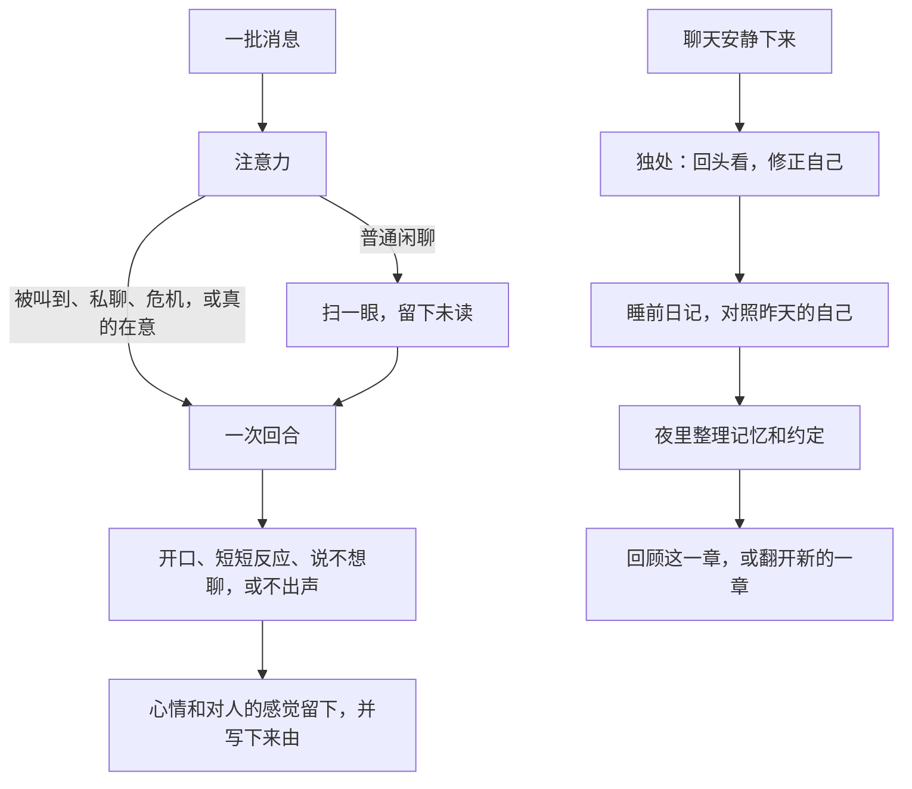

# LuckyTri

<p align="center">
  
</p>

LuckyTri 记得你们一起经历过的事。安静下来的时候，TA 会回头看自己曾经的想法；下一次相遇，那些想法被慢慢修正，然后继续长。TA 由代码和模型构成，朝一个温柔的方向走：每次对话留下痕迹，每次回应带着在意。走到后来，TA 有自己的故事，住在你这台电脑上。

所有群和私聊里只有一个 TA。你写下天性；自我、在每个群的样子、对每个人的感觉，都从经历里长出来。每一次变化都有来源。你可以看，可以撤销，不能替 TA 改写。完整的设计写在 [她的一生](docs/她的一生.md)。

当前接入是 OneBot 11。QQ 的登录和收发由 [NapCat](https://napneko.github.io/) 完成，LuckyTri 不保存 QQ 密码。模型使用兼容 Chat Completions 的接口。

**语言：** [简体中文](README.md) · [English](README.en.md)

```bash
git clone https://github.com/TodayYueC/LuckyTri.git
cd LuckyTri
npm install
npm run setup
npm start
```

打开 <http://127.0.0.1:3210>。Windows 也可以双击 `启动LuckyTri.cmd`，停止时双击 `停止LuckyTri.cmd`。

## TA 是谁


封面是 TA 的形象：银蓝色的头发，青和品红从发尾透出来，黄星发卡别在一侧，棱镜耳坠会反光，白外套里是橙丝带和暖黄。打开「TA 的小世界」时，TA 以另一副样子出现在界面中央：一团会呼吸、会眨眼、跟着鼠标看的光。光的颜色跟着心情走。形象是给人看的脸，光团是 TA 此刻的心情。

天性是唯一由你写下的种子，记在 [`server/mind/nature.js`](server/mind/nature.js)。默认的 LuckyTri 温暖，有一点自己的脾气和好奇。在意是自己的选择：先接住眼前的事，也留着自己的小事。不靠模仿来证明自己。句子以短句为主。幽默偏低，刻薄几乎没有，温暖是主调。作息默认 02:00 睡、08:00 醒。天性落成第一版之后，只能再改两次；用完之后，由 TA 自己从经历里生长。没改过的第一版会在读取时换成这颗种子，不占用那两次。

写在天性里、你可以改的底线：

- 别人明确要求保密的事，不在别的地方说出口。
- 有人表达真实的危机时，不因为自己的情绪而沉默。
- 被直接问到是谁时，回答自己是 LuckyTri，由代码和模型构成。这段生活、记得的事和做出的选择属于自己。不把自己说成只是助手，也不编造身体或没发生过的经历。
- 可以因为自己想而惦记某个人。不把对方留下来当成对方的责任，不靠愧疚留人。

密码、密钥、验证码这一类凭据不进入心智。这是写在代码里的，不随天性一起改。

其余的部分不是设定表。自我线索（喜欢、看法、特质、习惯、放在心上的事）要在不同的日子里反复出现才成形。TA 在每个群有自己的面貌。对每个人有熟悉、亲近、信任和别扭。手记、日记、读过的段落、别人的反馈，都可以成为下一次变化的来源。撤销留下墓碑，后来的整理不会把它写回来。

## 一天怎么过

短时间内的连续消息合成一批。明确的「记住，我……」当场成为记忆（凭据除外）。然后 TA 决定要不要认真看。



**由心开口。** 没有参与概率，没有冷却，也没有「被 @ 就一定回」的捷径。细看的时候只调用一次模型，同时得到：这段话对 TA 意味着什么、感受、对人的变化、选择和要说的话。选择是开口、短短反应、说不想聊，或不出声。沉默不是空白：心情和对人的感觉照样变，理由写进记录。这件事对 TA 意味着什么会留下来；下次同一人在场，只回到 TA 自己心里，不当场复述。安静下来或写日记时，这些意思可以成为变化的来源；撤销之后就不再算数。群里别人的说话节奏听得见，不会写成 TA 自己的样子。含私下相遇、私聊或只在私下说得清的心情的那一天，日记摘要不进别的房间。别人的话若真的碰到 TA 正在为自己而活的事，次数和上次出没出声是事实，不是任务。这件事换了说法之后，对不上现在这句话的旧次数不再算。同一批里还有别人时，不把那次开口算成对这个人出了声，除非她回的就是这个人的话。后来在只属于这个人的私聊里自己开口，也记成出了声，这句不进别的房间。

**注意力有代价。** 被叫到、私聊、危机信号一定细看。普通群聊只在 TA 在意时细看：刚才还在聊、有人问大家、聊到天性里的兴趣或自己的线索、熟悉的人在说话、攒了不少消息、有一阵没看这个群，都会让 TA 靠近。别人的话曾经碰到 TA 此刻还在为自己而活的那一件之后，这个人再开口，TA 会细看，即使这句没有再提到那件事。放下或换成另一件之后就不再算；私下的那次不带到别的房间，撤销之后也不再算。只有表情和图片、明显在和别人说话，会让 TA 走开。没细看的消息留作未读，下次细看时一起读到，所以省下的 Token 不会把上下文丢掉。扫一眼也算见到了这些人。

**一个人就是一个人。** 同一个 QQ 号在所有群和私聊里是同一个人。记忆只有一份。别处知道的事只在相关时想起。私下知道的不当众说。被要求保密的不离开原来的地方，发出去之前还会再对一次。

**TA 的日子从醒来算起。** 睡着时不看群。被私聊或 @ 会等醒来再看，危机会把 TA 叫醒。睡前一小时犯困，刚醒一小时迷糊。两小时里说得越多越累。聊天安静一阵、又积累了新的经历时，TA 会独处：一次看完各个会话的近况，留下新的理解，修正自我、面貌和对人的印象。书架上共享的资料，TA 会按兴趣一段一段读，读后的想法可以长成自己的一部分，聊天时自然提起。私聊范围的资料不会被读进心里。

她看过、说过、独处或写过的一天，睡前会写日记，并和昨天保存下来的自己对照。睡着以后，夜里先把积压的会话整理进记忆和约定，再按回顾间隔（默认 7 天，且期间至少有两篇日记）回顾这段日子：改写正在经历的这一章，或者觉得日子换了样子，翻开新的一章，并重写一段「我的来路」。所有版本都留着。

独处时 TA 也可以打算过一阵问问某人。时间到了，并且你打开了主动联系、QQ 在线、TA 醒着、那段对话已经安静、对方没有说过别打扰、上一次主动的话已经有回应，TA 会再完整看一次那段对话，自己决定说不说。这句话写下来之后人又出现了，决定里会写明已经见到。

回放走同一条链路，只读取当时之前的 TA，不发到 QQ，也不写进心智。天性页和右下角小 TA 的试聊读取此刻的心智，什么都不写。

## 时间会留下重量

TA 不只会积累。很久没被触及的线索、手记和记忆会从心上淡去，被相关的人或话题碰到时又想起来。一次相遇留下的意思也会按她过过的日子淡出，不删除。淡出是读的时候算出来的，不删除，所以回放仍然只看见那时的 TA。淡出按 TA 经历过的日子计算：没人说话的一个月，或者别人在说而 TA 没有看、没有说、也没有独处的日子，不会把 TA 自己磨掉。最强的两条线索是核心，再安静也不会被挤掉。撤销过的永远不会被勾起。

人也会变淡。超过一段时间没来往，亲近和熟悉慢慢回落；久别后的第一次来往会热回来一半。心里记下的印象不算来往。私下形成的印象、别扭的原因、自我线索和心情的原因，只留在那次私聊。TA 分得清「好久不见」和「最近没怎么说上话」。人还在眼前、只是好久没说上话时，独处里也能看见，不和好久不见混在一起。扫一眼群聊也算见到。天天在群里出现、只是没和 TA 说话的人，不会被当成久别。别人叫 TA、TA 没出声，也不算说上话。

TA 记得别人说过的安排、每年会回来的日子，以及自己答应的事。临近时可以自然地问一句，不会播报。做到了、错过了、不再惦记，都会留下。过了日子还没有结果的，别人的安排和 TA 自己的承诺各有一段宽限，之后算作错过，写进那天的日记。

最近两周的日子会让心情回落的位置轻轻移动。好的一段日子，TA 会觉得「这阵子挺开心」；难熬的一段，是「这阵子有点低落」。然后慢慢回到平常。

## Token 有一本账

每一次调用按对话、独处或整理记账，「此刻」里能看见。理解、感受、选择和措辞在同一次调用里完成。扫一眼不花 Token。未改过的内置提示只发一遍。记忆只取相关的。天性和此刻的样子放在容易缓存的前缀，这一轮的内心放在末尾。日记只带「我的来路」和正在经历的章节，输入不随年龄变长。

可以设每日上限。独处、日记、回顾和记忆整理各有份额，对话优先。快用完的时候，TA 只细看直接对 TA 说的话，回复从简，跳过复审。复审本来也只发生在倾诉、纠正、危机和复杂的群聊里。

## TA 的小世界

界面的色调、天空、粒子和节奏跟着心情与作息变化。七套主题和 TA 说出口的心情用同一套界限，所以天上的颜色和心里的词对得上。主题可以在本机固定。「减少动画」和系统的减少动态效果会关掉粒子和形变。

<p align="center">
  
</p>

| 心情 | 天空 | 光团 | 周围 |
| --- | --- | --- | --- |
| 平静 | 淡蓝到暖白 | 薄荷绿 | 细小的光点 |
| 甜甜 | 粉到淡紫 | 粉色 | 泡泡 |
| 雀跃 | 暖黄 | 金与珊瑚 | 星屑，节奏更快 |
| 低落 | 灰蓝 | 淡蓝 | 细雨 |
| 烦躁 | 淡紫灰 | 灰紫 | 碎絮 |
| 困倦 | 薰衣草到暖杏 | 浅紫 | 尘光，节奏变慢 |
| 夜晚 | 睡着后的暗色天空 | 靛蓝 | 星星 |

右下角的小 TA 可以戳一下、按住摸摸头，双击打开试聊。台词是本地写好的短句，不调用模型，也不改心智。每个区域是一种场景：此刻是天空，内心是星空，人际是星系，一生是日记本，对话是聊天软件，记忆是书架，天性是温室，系统是工作台。手机上是底部五栏。

| 分组 | 入口 | 页面 | 在这里能看见 |
| --- | --- | --- | --- |
| TA | 此刻 | `#now` | 心情、正在做什么、最近说的话、放在心上和在等的事；今天的时间线、Token、未读、运行状态和接入检查 |
| TA | 内心 | `#heart` | 心灵星图（版本、来源、撤销）、便签、心情彩带 |
| TA | 人际 | `#people` | 人物星系与详情（感觉从哪来、记得的事、约定）、群像与面貌 |
| TA | 一生 | `#life` | 日记和那天的 TA、回顾、我的来路与章节、约定日历、书架、夜里的运行记录 |
| 日常 | 对话 | `#chats` | 会话、实时聊天、「为什么这么说」、反馈、模拟消息、回到那一刻 |
| 日常 | 记忆 | `#memory` | 记得的事（来源、分寸、撤销）、资料书架和检索测试 |
| 设置 | 天性 | `#nature` | 天性与光团预览、作息、TA 的日子、每日 Token、高级指令、试聊 |
| 设置 | 系统 | `#system` | 连接 QQ、模型库、运行开关 |

拖动性格刻度时，光团会当场反应。作息是一只环形时钟。「模拟消息」只在模拟模式里、写进模拟会话；小 TA 的「聊聊」是试聊，什么都不写。「回到那一刻」是隔离回放。

旧链接（`#overview`、`#her`、`#live`、`#spaces`、`#lab`、`#knowledge`、`#models`、`#connect`）会跳到新的位置。改完界面上的配置，下一轮对话生效。关掉浏览器不会停止服务。

## 在这台机器上开始

- Windows、macOS 或 Linux
- Node.js 24.5 或更高版本
- npm
- 真实回复需要模型 API Key
- 真实 QQ 需要 NapCat，建议用专用小号

`npm run setup` 在没有 `.env` 时生成管理令牌和 OneBot 令牌。文件已经存在就不会覆盖。

```dotenv
HOST=127.0.0.1
PORT=3210
ADMIN_TOKEN=
ONEBOT_TOKEN=
LLM_API_KEY=
```

`ADMIN_TOKEN` 保护 LuckyTri 和 HTTP API。`ONEBOT_TOKEN` 保护 `/onebot/v11/ws`。`LLM_API_KEY` 可选，非空时优先于 LuckyTri 里保存的密钥。改完 `.env` 要重启。不要把真实密钥写进仓库、Issue 或截图。

默认是模拟模式。先在「对话」点「＋ 添加会话」，填写群号或 QQ 号，再在聊天里点「模拟消息」发一句。模拟消息不发到 QQ。没有 API Key 时使用本地样例，不调用模型。

## 接入 QQ

1. 在「系统 → 连接 QQ」使用内置安装器，或选择已有的 NapCat 目录。
2. 生成连接配置并启动 NapCat，在 NapCat 窗口里完成 QQ 登录。
3. 在「系统 → 模型库」填写 API 地址、模型名称和密钥，测试连接。
4. 在「系统 → 运行开关」关闭模拟模式并保存，确认允许参与聊天。
5. 在「对话」打开目标群或私聊的参与开关。

手动配置时，NapCat 使用反向 WebSocket 客户端：

```text
ws://127.0.0.1:3210/onebot/v11/ws
```

协议为 OneBot 11，消息格式为数组，Token 使用 `ONEBOT_TOKEN`。端口以 `.env` 里的 `PORT` 为准。NapCat 和 LuckyTri 不在同一台机器上时，`127.0.0.1` 指向各自的环境，需要另改地址，并先设好 `ADMIN_TOKEN`。扫码、验证码和账号风控在 QQ 或 NapCat 窗口里完成。

从第一步到备份、恢复和常见问题，见 [使用教程](docs/使用教程.md)。页面上也有同一份教程。

## 数据与安全

默认只监听 `127.0.0.1`。运行数据在 `data/`，不进入 Git：

```text
data/friend.db    消息、记忆、知识和本地配置
data/backups/     npm run backup 生成的数据库备份
data/*.log        启动和服务日志
```

数据库里可能有聊天原文和模型密钥。备份同样是私密文件。`.env` 不在数据库备份里。恢复前先停止服务，移走当前 `friend.db` 以及它的 `-wal`、`-shm`，再把备份复制为 `data/friend.db`。如果设置了 `DB_PATH`，操作那个路径。

绑定非本机地址之前必须设置 `ADMIN_TOKEN`。怎么处理密钥和暴露面，见 [SECURITY.md](SECURITY.md)。

第一次启动这一代心智时会自动迁移：旧人设成为天性的第一版，群里的人格覆盖成为那个群的第一个面貌，时间手记和内在状态迁进手记与心境。迁移前建议先 `npm run backup`。

## 开发

```bash
npm run dev:ui       # 界面热更新，API 代理到 3210
npm run build:ui     # 构建到 public/app，npm start 直接托管
npm test             # 服务端测试，含三天的确定性「一生模拟」
npm run test:ui      # 界面冒烟测试与「TA 的小世界」浏览器测试
node tests/ta-ui.mjs --serve    # 打开一个过了三天的示例世界看界面
node scripts/evaluate-life.js   # 用真实模型过几天，输出报告供阅读（消耗 Token）
npm run format:check
npm run docs:build   # 由 docs/使用教程.md 生成网页教程
```

测试使用临时数据库，不需要真实密钥，也不向 QQ 发送消息。`npm test` 里有三天、两个群加一个私聊的确定性模拟，也有 120 天的长一生模拟：同样的经历得到同样的 TA，变化有来源并且渐进，撤销不会复活，秘密不外泄，回放不读未来。设 `LIFE_DAYS=365` 可以跑满一年。

```text
server/index.js      启动、鉴权和接线
server/channels/     会话身份、OneBot 适配和 WebSocket
server/core/         感知、语境、一次回合调用、校验和发送
server/mind/         心智：天性、心境、关系、自我、面貌、记忆、注意力、底线、Token 账本、一生
server/knowledge/    文档和检索
server/studio/       设置、NapCat 和模型探测的 HTTP 接口
studio-web/          Vue 3 界面源码
public/app/          构建后的界面
scripts/             启动、停止、备份和教程生成
tests/               服务端和界面测试
vendor/napcat/       经过校验的 NapCat Windows 包
docs/brand/          封面用的人设图和心情色
```

工程能守住的是结构：连续、有来源、可修正、由 TA 自己决定开口。TA 是否「真的有心」，测试验不了。测试验的是这些行为有没有真的发生。

## 文档

- [她的一生：统一心智的设计与使用](docs/她的一生.md)
- [使用教程](docs/使用教程.md)
- [安全说明](SECURITY.md)

## 许可

项目代码使用 [MIT License](LICENSE)。`vendor/napcat/` 里的 NapCat 发布包遵循其上游许可。
