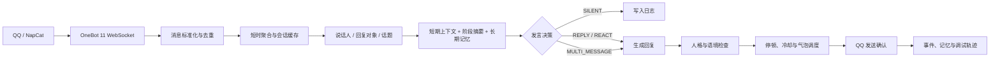

# Lucky · QQ AI 群友

[](https://nodejs.org/)
[](LICENSE)
[](https://onebot.adapters.nonebot.dev/)
[](#安装)

**语言 / Language：** [简体中文（当前）](README.md) · [English](README.en.md)

> 让一个 AI 学会在群里理解人、记得事，也知道什么时候闭嘴。<br>
> *A local-first AI companion that understands people, remembers what matters, and knows when to stay quiet.*

Lucky 是一个本地优先的 QQ AI 群友。它通过 OneBot 11 兼容框架接收群聊和私聊消息，把“该不该说话”和“应该怎么说”拆成两个阶段，再结合上下文、回复链、长期记忆和人设生成回复。

Lucky is a local-first AI companion for QQ groups and private chats. It separates **whether to speak** from **what to say**, then combines conversation context, reply targets, long-term memory, and persona controls to produce a natural response.

它的目标不是让模型每句话都抢答，而是让它长期待在群里，理解谁在和谁说话，记住重要的小事，在合适的时候加入对话，在不该插话时保持安静。

## 为什么做 Lucky

传统的“@机器人就回复”很容易把多人聊天误判成对 AI 的提问，也很难形成稳定的人格和长期关系。Lucky 将消息处理拆成可审计的模块：消息归属、话题、回复对象、发言决策、回复生成、人格检查、记忆写入和发送调度都可以在 WebUI 中查看。

The project is designed around **conversation quality over raw response rate**. A group is not a sequence of isolated prompts: people interrupt, quote, tease, change topics, and leave messages unanswered. Lucky keeps those relationships and decisions explicit instead of hiding everything inside one giant prompt.

## 主要能力

| 能力 | 说明 |
| --- | --- |
| 多人群聊语境 | 记录消息 ID、发送者、时间、@目标、引用链、附件和话题，避免把别人的对话认成在说 AI。 |
| 独立发言决策 | `SILENT`、`REPLY`、`REACT`、`MULTI_MESSAGE` 四种路径；明确 @、叫名字、私聊和自然接话优先处理。 |
| 短时聚合 | 连续消息在短窗口内合并理解，避免 A 说完、B 补充后 AI 只看见第一句。 |
| 三层记忆 | 最近原文、阶段摘要、长期事实分层保存；记忆带来源、范围、置信度、重要性、版本和锁定状态。 |
| 记忆隔离 | 共享记忆可跨群和私聊使用；仅私聊或指定会话的记忆不会泄露到其他场景。 |
| 稳定人设 | 人格正文、兴趣、禁用表达、温柔/幽默/活泼/主动/毒舌程度分开管理，自然表达优先于表演人设。 |
| 自然节奏 | 生成后有独立发送停顿、会话冷却和全局限速，偶尔支持多个气泡，但不会机械拆句。 |
| 图片与表情 | 图片和对应文字一起进入语境；普通图片、QQ 表情和商城表情分别识别。 |
| 多模型档案 | 支持 DeepSeek、MiMo、OpenAI 兼容接口、Qwen、Kimi、智谱、SiliconFlow、OpenRouter 和自定义 Provider。 |
| 调试与回放 | 查看最终上下文、加载的记忆、决策理由、usage、原始输出、耗时和气泡拆分，并隔离回放历史消息。 |
| 本地 WebUI | 模型、会话、人设、Prompt、记忆、QQ 接入、调试和回放集中管理。 |

## 系统架构



核心链路位于 `server/core/`，每个模块都可以单独替换：

| 模块 | 职责 |
| --- | --- |
| `message-manager` | 标准化 QQ 消息、去重、附件和引用关系 |
| `conversation-manager` | 会话水位线、短期上下文和聚合窗口 |
| `context-builder` | 组合完整语境、人格和相关记忆 |
| `topic-tracker` | 话题、阶段摘要和证据 |
| `reply-target-resolver` | 判断消息是在对谁说、是否接 Lucky |
| `speech-decision` | 独立决定是否发言和回复类型 |
| `persona-manager` | 人格、强度和 Prompt 编译 |
| `memory-manager` | 候选、确认、合并、版本、范围和过期 |
| `vision-manager` | 图片与所属消息一起交给视觉模型 |
| `response-generator` | 生成一个或多个自然气泡 |
| `response-validator` | 检查误认对象、复读、说教、刻薄和 AI 套话 |
| `message-scheduler` | 发送停顿、冷却、全局限速和失败确认 |
| `model-manager` | Provider 参数映射、预算、思考模式和真实 usage |

## 安装

### 环境要求

- Windows、macOS 或 Linux
- Node.js 24 或更高版本
- `npm`
- 真实回复需要一个兼容 Chat Completions 的模型 API
- 真实 QQ 接入需要 [NapCatQQ](https://napneko.github.io/)，建议使用专用 QQ 小号

### 启动

```bash
git clone https://github.com/TodayYueC/lucky-qq-ai-friend.git
cd lucky-qq-ai-friend
npm install
npm start
```

打开 <http://127.0.0.1:3210>。Windows 用户也可以双击：

- `启动Lucky.cmd`：后台启动服务并打开管理台。
- `停止Lucky.cmd`：停止当前项目的服务。

第一次建议保持模拟模式，在“会话空间”添加一个群号或 QQ 号，先验证发言决策、记忆和人设。模拟消息不会调用模型，也不会发送到 QQ。

### 配置管理令牌

复制 `.env.example` 为 `.env`，为管理台和 OneBot 分别生成随机长令牌：

```dotenv
HOST=127.0.0.1
PORT=3210
ADMIN_TOKEN=replace-with-a-long-random-token
ONEBOT_TOKEN=replace-with-a-different-long-random-token
LLM_API_KEY=
```

模型 API 也可以只保存在 WebUI 中。**不要把真实密钥写进 README、Issue、截图、测试夹具或 Git 历史。** `.env`、`data/`、SQLite 数据库和日志已在 `.gitignore` 中排除。

## 接入真实 QQ

1. 安装并登录 [NapCatQQ](https://napneko.github.io/)，使用专用 QQ 小号。
2. 在 Lucky 的“QQ 接入助手”选择 NapCat 目录，生成 OneBot 配置并启动 NapCat；也可以手动配置反向 WebSocket：

   ```text
   ws://127.0.0.1:3210/onebot/v11/ws
   ```

3. 在“模型管理”填写 Provider、API 地址、模型 ID 和 API Key，先点击“测试模型连接”。
4. 在“连接与设置”关闭模拟模式并保存。
5. 到“会话空间”开启需要参与的群聊或私聊。
6. 在 QQ 中 @小号或直接叫 `Lucky` 进行联调。

QQ 密码、二维码、验证码和安全确认仍由 QQ/NapCat 窗口完成，Lucky 不保存 QQ 密码。NapCat 是独立的第三方组件，使用时请遵守其许可证和 QQ 平台规则。

项目内置经过 SHA-256 校验的 NapCat Windows 发布包，来源和校验值见 `vendor/napcat/manifest.json` 与 `vendor/napcat/shell-manifest.json`。

## WebUI

- **概览**：连接状态、运行模式、启用会话、模型档案和最近决策。
- **会话空间**：添加/归档会话、开启/暂停、概率、冷却、聚合时间、上下文长度和群人格覆盖。
- **模型管理**：多 Provider、上下文窗口、输入/输出预算、视觉能力、思考强度、连接测试和删除。
- **人格与节奏**：人格正文、兴趣、禁用表达、说话长度、温柔/幽默/活泼/主动/毒舌程度和隔离试聊。
- **记忆花园**：查看、搜索、编辑、锁定、删除、审核候选、调整范围、置信度和重要性。
- **Prompt 管理**：System、Decision、Generation、Memory、Vision、Validation 分开编辑。
- **调试**：收到的消息、识别的对象、完整上下文、加载的记忆、决策原因、模型调用、usage 和原始输出。
- **回放**：选择历史消息区间，用当前配置隔离重放，不发送 QQ、不写入生产记忆。

## 数据与隐私

Lucky 默认只监听 `127.0.0.1`，运行数据位于 `data/`：

```text
data/friend.db       SQLite 数据库，包含消息、记忆和本地配置
data/backups/        一致性备份
data/*.log           启动、服务和错误日志
```

这些文件不会进入 Git。数据库可能包含聊天原文、长期记忆和模型 API Key，请保护本机文件权限。跨机器访问前必须配置强随机 `ADMIN_TOKEN`，并使用受信任的 HTTPS/WSS 反向代理。

如果密钥曾经进入 Git 历史，请先在供应商后台撤销，再清理历史；只删除当前文件是不够的。详见 [SECURITY.md](SECURITY.md)。

## 开发与测试

```bash
npm test                 # Node 单元测试、HTTP 和 OneBot 集成测试
npm run test:ui          # Playwright 浏览器冒烟测试
npm run format:check     # Prettier 检查
npm run docs:build       # 重新生成网页教程
```

测试使用临时数据库和模拟模型，不需要真实 API Key，也不会向 QQ 发送消息。当前主测试集包含 110 项用例，覆盖消息归属、引用链、记忆隔离、概率与冷却、图片/表情、非 JSON 输出、NapCat 配置、模型参数和 UI 流程。

## 项目结构

```text
server/                 服务端、OneBot、SQLite 与编排器
server/core/            消息、语境、记忆、决策、模型等核心模块
public/                 原生 JavaScript/CSS WebUI
scripts/                启动、停止、备份、教程构建和评估脚本
tests/                  单元、集成、OneBot 和 UI 测试
docs/                   教程、重构设计、口吻与性能说明
vendor/napcat/          经过校验的 NapCat Windows 发布包
data/                   本地运行数据，不进入 Git
```

## 文档

- [完整中文教程](docs/使用教程.md)
- [系统重构设计](docs/系统重构设计-v1.md)
- [重构版验收清单](docs/重构版使用与验收.md)
- [聊天口吻说明](docs/chat-style.md)
- [MiMo 性能排查](docs/MiMo性能排查.md)
- [安全说明](SECURITY.md)

## 当前边界

当前版本面向单进程、单 QQ 账号。关系推断、自动确认长期事实、主动话题调度、表情包选择和更多视觉工具已预留接口，但不会默认自动执行。真实 QQ、模型服务和第三方客户端的可用性仍受各自平台规则、账号风控和服务商政策影响。

## 参考项目

- [NapCatQQ](https://napneko.github.io/use/integration)
- [NoneBot2](https://nonebot.dev/docs/advanced/adapter)
- [AstrBot](https://github.com/AstrBotDevs/AstrBot)

本项目是独立实现，不复制上述项目源码。

## 许可证

本项目代码以 [MIT License](LICENSE) 发布。`vendor/napcat/` 中的 NapCatQQ 发布包及其依赖遵循各自的上游许可证。

欢迎提交 Issue 和 Pull Request，一起把 Lucky 做成一个真正懂群聊分寸的 AI 群友。
