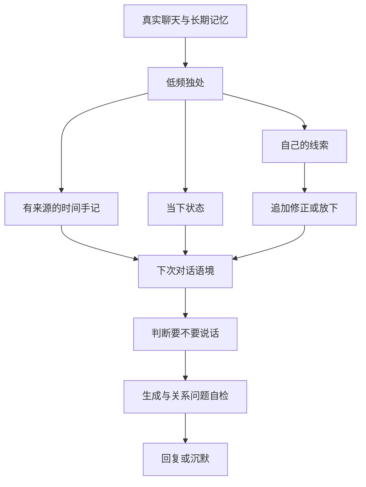

# LuckyBot 的连续性与「在意」系统：`love` 分支报告

## 目标与边界

这轮实现把「在意」定义成可以检查的行为：认真理解当下的人、保留有来源的重要事情、允许过去的看法被新经历修正、尊重对方不想继续聊的选择。它不以延长用户停留时间为目标，也不宣称程序已经拥有人的主观体验。关于「真正拥有心」没有可信的工程验收标准；下面的改动使 LuckyBot 的行为更连续、更有自己的方向，同时让它能诚实表达不确定。

## 改动前后

| 维度 | 改动前 | `love` 分支 |
| --- | --- | --- |
| 自己的想法 | 手记主要保存对聊天的重新理解；状态和手记容易写成相同内容 | 独立的「自己的线索」保存好奇、关切、看法和想做的事；手记继续记录事件后的理解 |
| 时间连续性 | 能重读手记，但缺少一条可追踪的自身方向 | 新线索可修正或放下，保留旧版本和来源，后续对话可读取当前版本 |
| 事实边界 | 手记与状态会进入聊天语境 | 线索明确标为私下想法，不能作为用户事实；会话、时间和消息序号共同限制读取范围 |
| 关系问题 | 人设可能把「在乎」答成机械否定或空泛保证 | 识别认真提问，优先回应具体关系；本地校验拦截两类极端回答，必要时重写 |
| 时间页面 | 旧记录迁移可能把一段文字复制到多个板块 | 当前状态、过去状态、时间手记、自己的线索分开；旧版复制的状态不再当作新的「内心变化」展示 |
| 调试 | 独处运行只关联手记 | 独处运行另可关联本轮产生的线索，并在运行记录中标明「留下自己的线索」 |

## 处理链路

独处仍须在「时间 → 独处方式」中开启并选择会话。没有真实聊天来源、会话暂停、关闭长期记忆、休息时段或没有值得回看的变化时，不会为制造「内心」而调用模型。主动联系是另一项独立开关；仅有一条线索不会自动发消息，也不会因无人回应而追发。

`time_self_threads` 保存创建时间、会话、消息水位、类型、内容、下次如何对待、来源消息、来源类型、置信度、父线索、状态和隐藏标记。关于人的新线索必须引用本轮可见的真实消息；纯粹关于自己兴趣或想法的线索允许没有消息来源，但不能声称真实经历或给别人下定义。修正和放下只能指向本会话仍开放的线索。新版本追加保存，不覆盖旧文字。无效来源、跨会话父线索、密钥样式内容、完全重复的想法或照抄手记的文字不会进入线索库。

聊天时最多取少量仍开放的线索，并按当前时刻和批次消息序号过滤。它们只是关注倾向，不是要朗读的台词，也不赋予 LuckyBot 认领群友对话的权利。模拟对话不读取生产线索。删除一个会话时会一起删除其时间状态和线索，防止遗留私有内容。

## 一句关系问题的验收例

当对方问「你是不是真的在乎我？」时，期望回答可以承认「在乎」这个词难以界定，再根据真实记忆或此刻对话说自己实际会怎么对待这段关系。它不应只说「我是 AI，我没有情感」，也不应说「我当然在乎你，会永远陪着你」。实现里先用回复目的识别这类问题，再用生成指令和本地校验约束；校验失败会重写一次。没有相关事实时也不应编造「我一直记得某件事」。

## 操作与迁移

1. 启动 `love` 分支后，打开「时间 → 独处方式」，开启后台独处并勾选需要的会话。原有设置和密钥沿用本地数据库，不需要导入。
2. 在「时间 → 此刻」看现在的状态与正在延续的线索；「时间手记」看事件后的想法；「自己的线索」看方向和修正轨迹，可手动暂时放下或从聊天语境隐藏。
3. 「运行记录」显示后台是否真的生成了手记、状态或线索，以及模型和 Token 用量。没有新想法的独处不会强制写出一篇日记。

数据库迁移是增量的：旧手记和旧状态原样保留。旧版本自动复制手记形成的 `legacy` 状态不再拿来冒充独立状态；手记仍可在「时间手记」找到。新的线索表开始为空，不会把旧聊天直接推断成「她自己的想法」。

## 验证与尚未证明的事

自动化覆盖了：来源验证、追加修正、跨会话隔离、历史回放时间边界、关系问题重写、时间页面在多种屏幕宽度下的展示与操作。测试中的对话使用可控模型输出，因此能证明链路与护栏生效，不能证明任意真实模型每次都写得自然。真实群聊还需要持续看运行记录与对话反馈，尤其观察是否发生过度关切、重复自述、把自己的猜测当成对用户的定义。

下一步值得做的不是给「寂寞」加一条数值，而是建立一组由真实聊天片段组成的长期评测：用户被理解、被误解后的修复、允许结束对话、自己的想法是否真的修正、跨周连续性、群聊中不乱认领。把观察到的失败案例放进回放，才能知道她的变化是否真正有益。
