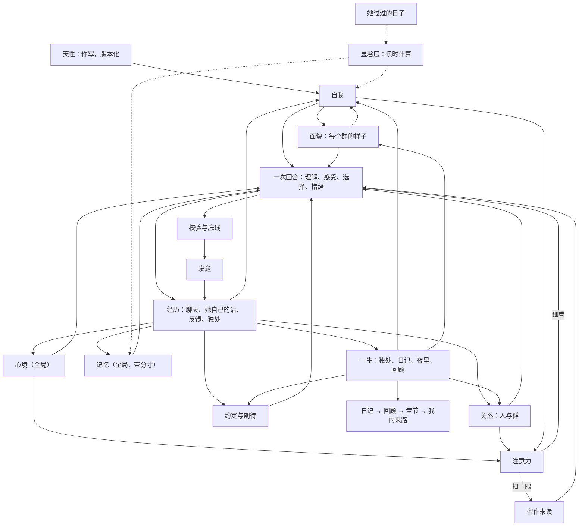

# 她的一生：统一心智的设计与使用

LuckyBot 从这一版开始不再是「按会话隔离、由概率和规则决定开不开口、人格固定不变」的机器人。所有群聊和私聊里只有一个她：她有自己的心情和精力，对每个人有感觉，在每个群有自己的样子，会在安静时独处、在睡前写日记，会重新理解过去的自己。你写下她的天性；其余的部分从经历里长出来，每一次变化都能看到来源，也都能撤销。

她不只会积累。很久没被触及的东西会从心上淡去，被相关的人或话题碰到时又会想起；久别的人会变淡，重逢时很快热络；她记得别人说过的安排和自己答应的事；每隔一段时间，她会在夜里回顾这段日子，改写自传，或者翻开新的一章。

## 已定原则

- **一个她**。会话只是「事情发生在哪里」的标注，不再是隔离墙。同一个 QQ 号在所有群和私聊里是同一个人。
- **天性是种子**。天性（名字、性格、兴趣、边界、底线、作息）是唯一由你编写的部分。自我、面貌、关系由她自己形成；你能看、能撤销，但不能替她改写。
- **由心开口**。没有参与概率、冷却抽样和「被 @ 必回」。每次细看一段对话，她都先理解这对她意味着什么，再选择说、简短反应、说不想聊或不出声，并留下自己的理由。沉默时她的心情和对人的感觉照样会变。
- **有来源、渐进、可撤销**。心智表只追加不覆盖。每条变化都引用具体经历（消息、手记、反馈、读过的段落、日记、约定）。一次经历只让强度小幅变化；同一段经历再引用一次，强度不再升高，原话再写一遍也不另记一版。换了说法可以留下，强度仍要等新的经历。新的特质要在不同的日子里反复出现才成形。撤销留下墓碑，之后的整理不会把它写回来。
- **会淡去，也会想起**。淡出是读的时候算出来的，不写任何「已淡出」标记，所以回放仍然只读过去。淡出按她经历过的日子计算（有经历的天数），不按日历：没人说话的一个月里，她不会把自己忘掉。被这批消息勾起的旧念头只是被看见，不产生写入；要重新变强，仍然要引用新的经历。撤销仍是唯一的删除。
- **注意力有代价**。扫一眼群聊不花 Token；只有真的在意时才细看。一天的 Token 有上限时，对话优先，独处和整理用各自的份额。每一类调用的输入都有上限，不随她活得多久而增长。

## 模块地图

```text
server/core/      感官与嘴：接收、聚合、感知（谁在对谁说）、语境、一次回合调用、校验、发送
server/mind/      她的心智
  nature.js       天性（版本化，唯一可编辑）、作息与「她的一天从几点开始」
  affect.js       心境：唯一的、全局的情绪与精力，由经历推动、随时间回落；「这阵子」的基线
  bonds.js        关系：对每个人、每个群的熟悉、亲近、信任、别扭；久别变淡、重逢回暖；人员目录
  self.js         自我：喜欢、看法、特质、习惯、想做的事、放在心上的事、好奇；按显著度排序与唤起
  faces.js        面貌：她在每个群的角色、说话方式、想成为的样子
  thoughts.js     手记：独处后留下的理解，修正时追加；可以放下
  memory.js       记忆：一份全局记忆，带来源和分寸（公开 / 私下 / 保密）；会淡出、可被新事实取代
  days.js         她过过的日子：每个生活日一行，淡出按这些日子计算；第几天与纪念日
  salience.js     显著度：各类内容的半衰期与阈值
  anticipations.js 约定与期待：她答应的事、她想做的事、别人的安排、每年的日子
  meetings.js     相遇：这件事对她意味着什么；别人的话有没有碰到她正在为自己而活的事
  periods.js      回顾、自传章节与「我的来路」，每次重写都保留旧版本
  attention.js    注意力：确定性的「细看还是扫一眼」
  guard.js        底线：凭据、保密、危机
  budget.js       Token 账本与每日份额
  view.js         给每次调用的「此刻的她」（有上限的几百 Token）
  reading.js      阅读：按兴趣和她正在为自己而活的事从共享知识库挑着读，分段读下去
  life.js         一生：醒来、独处、阅读、睡前日记、夜里、回顾、主动联系
  index.js        Mind：把上面这些连成一个人
  api.js          /api/mind/*
```



## 一次「看见」的流程

1. **接收与聚合**。短时间内的连续消息合成一批。明确的「记住，我……」当场成为记忆（凭据除外），不再等待人工审核。
2. **感知**。解析 @、引用链、点名和回复对象，得到每条消息与她的关系（叫她 / 在和别人说 / 不确定）。
3. **注意力**（不调用模型）。被叫到、私聊、危机信号一定细看。普通群聊按确定性的分数决定：刚才她还在聊、有人问大家、聊到她天性里的兴趣或自我线索、熟悉的人在说话、攒了不少消息、有一阵没看群，都会加分。聊到她正在为自己而活的那件事时，规则和记下被碰到一样：同一个人自己的话对上两个词，这件事只有一个特有的词时一个词就够；两个人的话不能拼在一起，她自己说过的话也不算。别人的话曾经碰到她此刻还在为自己而活的那一件之后，这个人再开口她会细看，即使这句没有再提到那件事。放下或换成另一件之后，旧的碰到不再把人拉回来。只有表情和图片、明显在和别人说话会减分，这两样也不会因为上次碰到过就细看。私下的那次不带到别的房间。撤销之后，这个人恢复成普通群友。精力低、Token 紧张时门槛变高；天性里的「主动」越高门槛越低。没细看的消息保留为未读，下一次细看时一起读到，所以不会因为省 Token 丢掉上下文。扫一眼也算「见到了」这些人。维护定时器每隔一阵也会回头看看安静下来的群。
4. **回忆**。一份全局记忆：先看当前说话的人和话题，别处知道的事只在相关时想起；私聊里知道的带上「私下知道，不要当众说出口」。如果回复里还是带上了这些原话，或者一句没有来源的小事和它们对得上，发出去之前会拦下重写，那句小事也只留在那次私聊。被要求保密的事绝不进入别的会话。很久没被想起、又不太重要的记忆只在被真正聊到（两个以上的词对得上）或本人正在说话时才回来；超过一周的记忆带上「几个月前知道的」，她才知道那是旧消息。再加上知识库、分层语境摘要和阶段总结。
5. **此刻的她**。`self`（她在这里的样子、此刻最有分量的几条自我线索、最近一篇日记）放进可缓存的前缀，一天只变几次；最强的两条线索是她的核心，再安静也不会被挤掉。`inner`（醒着 / 犯困、精力、心情和原因、「这阵子」、对在场的人的感觉、放在心上的事、临近的约定、和在场的人上次相遇时这件事对她意味着什么、正在为自己而活的事被别人的话碰到过几次、被这批消息勾起的旧念头、这个地方别人说话的节奏、最近听到的反馈）放在每轮末尾。这个地方的节奏不是她的样子，也不进可缓存的 `self`。整体有几百 Token 的上限。私下的相遇不进别的会话。那一天如果留过私下的相遇、私聊里的话，或一句只在私下说得清的心情，最近一篇日记的摘要也不进别的房间。
6. **一次回合调用**。模型一次输出：这对我意味着什么、感受、对人的变化、选择（speak / react / decline / silent）、理由、回复目标和要说的话。私聊和 @ 仍只调用一次；群里开口时比旧版少一次决策调用。
7. **经历**。无论说不说，感受写入心境，对人的变化写入关系（必须引用这批里的消息），她的选择和理由写入记录，被叫到的人和她聊过的人熟悉度增长。别人叫她、她没出声，不算说上话，也不会把「好久没说上话」清掉。她对这次相遇的理解（`appraisal`）留下一条，下次这个人在场时回到 `inner.with`，供她自己接着理解，不复述给对方。独处和日记也能看见这些理解，引用时写成 `g:`；没给她看过的、撤销过的，都不能成为变化的来源。私下的相遇或私下的原话可以改变她自己，不能据此去别的会话计划开口。别人话里的词若碰到她正在为自己而活的那件事，记一次「被碰到」。这件事后来换了说法，只有仍然对得上现在这句话的旧相遇才继续算数。要对上两个词；这件事本身只有一个特有的词时，一个词就够。必须是同一个人自己说的话，不能把两个人的话拼在一起，旁边接话的人也不算。只写在她自己的理解里不算。私下的碰到不写进别的房间的 `inner.will`。后来又单独见到这个人时，出没出声按后来的那次算；同一批里还有别人时，不把那次开口算成对这个人出了声，除非她回的就是这个人的话。对方只是叫了她、她没出声，也不算。后来在只属于这个人的私聊里自己开口，也按出了声记，别的房间不写这一次。次数不因此增加；中间隔了多少别人的话都不影响。撤销这条相遇后，理解和计数都不再回来。回放只看见那个时刻之前已经留下的相遇。
8. **措辞与校验**。本地校验（重复、客服腔、刻薄、字数、简短反应要短）和保密检查；倾诉、纠正、危机或复杂的群聊回复额外复审一次（Token 紧张时跳过）；最多重写一次，仍不合格就用安全短句。
9. **发送**。发送前再检查语境是否过期、会话是否仍开启；每分钟发言轮数限制、发件箱、不确定投递不重发都保留。

回放和试聊走同一条链路，但回放只读取当时之前的心智（按时间点重建心境、关系、自我、显著度、放下的手记和结束的约定），试聊读取她此刻的心智但不写入、不发 QQ。

## 她的一天

- **作息**（天性里设置，默认 02:00 睡、08:00 醒）。睡着时不看群；被私聊或 @ 会等醒来再看；危机消息会叫醒她。睡前一小时犯困、刚醒一小时迷糊，精力随之变化。两小时内说话越多越累。她的一天从醒来算起。
- **醒来**。先读睡着时收到的直接消息，自己决定怎么回（可以自然地说「刚看到」）。
- **独处**。聊天安静一阵、积累了新的经历、距离上次足够久时，她会一次看完所有会话的近况（每个会话最近几十条、阶段总结、她自己说过的话、收到的反馈、放在心上的旧想法、这段时间已经留下的相遇意义），留下新的理解，修正自我、面貌和对人的印象，心情也会变。她也会看到正在淡出的线索（可以放下，或者在有新经历时重新确认）、好久没见又挺在意的人（可以想起他，也可以计划联系）、人还在眼前但你们有一阵没说上话的亲近的人，包括还从没说过话的（这和好久不见不是一回事，可以想起，也可以计划一句，不催）、好久没见到而他们的话曾经碰到她正在为自己而活的事的人（可以想起，也可以回到那次的会话计划一句，不催，不靠愧疚；由此写下的打算和手记也留在那次的会话；引用公开来源的手记只留在来源所在的会话）、在等的事（可以计划问一句结果，或者把有了结果的事结束掉），以及自己正在经历的这一章和正在为自己而活的那一件小事。这件事可以让心情变一点，可以改她在某个地方想成为的样子，也可以据此对具体的人计划一句主动的话；来源是她自己的那条线索。不催人，不靠愧疚留人。在等的事临近或刚过去，也是安静一会儿的理由。独处时也可以留下一件说得清、只属于自己的小事，不必引用某条消息；看法、特质、习惯和放在心上的事仍然要有来源。这件事出现在 `self.livingFor`，下一次开口时还在。别的房间如果看不见更强的那件私下的事，就用下一件她在那里仍然在过的事；不会因为私下的那件更强，就变成那里什么都没在过。别人的话只碰到这个房间里的这一件。独处时，另一件仍在过的事如果也有人好久没见到，不会因为私下的那件更强就从名单里消失，也不会被那件私事的好几个人占满。强度和别的新线索一样有上限。独处期间又有了新对话时，已经想好的仍然留下（它们引用的都是之前的经历），只是不再打算在那个会话主动开口，心情也不因此改变；天性被改了，这次想法才不作数。
- **睡前日记**。一天结束时，如果她真的看过、说过、独处或写过，她会写日记，并和「昨天的她」（前一天保存的快照）对照。别人的消息本身不算这一天有过经历。写的时候不把私下长成的线索、私下的印象，或昨天那篇因此不能外带的日记，再写进材料里；独处时这些仍然在。回顾时，这样的一天只留下「原文不带到回顾里」，不把那篇日记写进来路。引用这一天长成的线索，也只留在那次私聊。私下的打算和答应的事可以写进那天的日记，摘要留在那次私聊；回顾不把原文写进来路。还没到那一天时，这些不写进别的日子的日记材料。日记只带上「我的来路」、正在经历的这一章、今天是第几天、今天的纪念日、今天做到的、错过的和仍在等的事，以及今天已经留下的相遇意义，不再带上所有章节，所以日记的输入不随她的年龄增长。她可以在日记里放下不再挂心的手记。写失败会隔几个小时再试，最多三次。
- **夜里**（天性页「夜里整理」，默认开启）。日记写完、她睡着以后（没开作息则在 03:00–06:00），每次只做一件事：先把积压了 6 条以上用户消息的会话整理进记忆和约定，消息少的私聊也不用等攒够 40 条；然后在回顾到期时回顾。
- **回顾与自传**。日记攒到两篇以后，她会在夜里第一次回顾；之后每隔「回顾间隔」天（默认 7 天，且期间至少有两篇日记）回顾一次：读这段时间的日记、这段时间自己的变化（新出现的、淡出的、变了的线索，变化最大的关系）、做到和错过的约定，写下回顾和「和上次比」。回顾时她会改写正在经历的这一章，写成她自己正在过的日子，而不是别人的流水账；或者觉得日子换了样子、翻开新的一章。翻篇时重写一段不超过 600 字的「我的来路」。如果她正在为自己而活的事还没写进现有的来路，这一次回顾也会重写，别人仍是她生活里的人，不是这篇的主角。所有版本都保留。
- **阅读**。独处时，她会从「记忆 → 资料书架」里的**共享**集合挑自己感兴趣的读（按天性里的兴趣、她此刻在意的线索，以及她正在为自己而活的那件事），读完一段接着读下一段，写下一句读后的想法；读到的内容可以成为手记和自我的来源（`r:段落`）。最近读过的东西会留在她的样子里，聊天时可以自然提起。读后的那一句如果和私下的原话对得上，不进别的房间；书名仍在。日记摘要、手记、面貌、印象、相遇的意思、约定和心情原因里对得上的句子同样不进别的房间。来路和章节里对得上的句子不写进后来的日记和回顾；其余的话还在。书架上还有没读的，也是隔几个小时安静一会儿的理由。私聊范围的资料不会被她读进心里；订阅源不抓取。
- **主动联系**。独处时她可以计划「过一阵想问问某人某件事」，包括好久没见的人和她在等的事。时间到了、你打开了主动联系、QQ 在线、她醒着、那段对话已经安静三小时以上、对方没说过别打扰、上一次主动的话已经有回应时，她会再完整看一次那段对话，自己决定说不说。如果这句话写下来之后那个人又出现了，这次决定里会写明已经见到，她可以仍然说，也可以不出声。

## 时间的重量

- **自我线索**：最后一次被新的经历触及之后，宽限 3 个有经历的日子，再按半衰期淡去（特质 180 天、看法与习惯 90 天、喜欢 60 天、放在心上与想做的事 30 天、好奇 21 天；证据跨 5 天以上的特质再慢一倍）。换一种说法不重新计算这段时间。分量低于 0.12 就从心上淡出，但不会被删掉：之后再次提到时是「回来」，不会长出第二条。
- **手记**：按重要度和半衰期淡去（仍放在心上 21 天、重新理解 14 天、后来想到与久别想起 10 天）；约好的回看时间到了会重新浮上来一阵。写下修正时，旧的那条会被放下；修正必须带上这回新的经历，只把已经用过的来源再写一遍，不会把旧的放下、换成一条刚写下的。换一种说法另写一条可以留下，但它在心上的时间仍从第一次记下那段经历算起。约好的回看会让那条真正记下经历的手记再浮上来；只把旧来源换个说法再约一次，不会把它拉回来。她也可以在独处和日记里主动放下，界面上的「放下这件事」同样记下放下的时间。
- **相遇**：一次相遇对她意味着什么，按 21 个有经历的日子的半衰期从心上淡出，低于 0.12 就不再出现在 `inner.with`，也不再因此把那个人拉回来细看。不删除。这批消息若和那句意思对上两个词，它出现在 `inner.reminded`，标着「很久没想起了」，不写入，也不因此细看。后面又有多少次相遇，都不挡住这次想起。愿望如果还在，碰到的次数仍是事实。没过上的日子不算。别人在说话、她没有看也没有说、也没有独处或写日记的日子，同样不算。以前按消息条数记下的日子，下次启动会按这条改回来。回看当时，那次相遇还在。
- **被勾起**：这批消息里和淡出的线索、手记有两个以上词对得上时，它们会出现在 `inner.reminded`，标着「很久没想起了」。它们只在每轮末尾出现，不进可缓存的 `self`，也不写入任何东西。撤销过的永远不会被勾起。
- **记忆**：不重要（重要度低于 0.6）、没有锁定、45 个有经历的日子里没被想起的记忆，只有被真正聊到或本人在说话时才回来；只擦到一个词、被人带出来，不算想起，也不会把这 45 天重新算起。最近被真正想起过的排得更靠前。整理记忆时会带上她已经记得的事，新事实推翻旧的（搬家、换工作、改了主意）时，旧记忆标为「已被取代」，保留版本，不再被想起。
- **关系**：超过两周没来往，亲近度会以 60 天的半衰期回落到最好时的一半（不低于初识），熟悉度以 120 天回落到最好时的六成；久别后的第一次来往会找回一半。心里记下的印象不算来往，不会把久别冲掉，也不会当成重逢。隔几天记一次，亲近仍然按上次真正的相处变淡。同一段经历被反复写成更亲近，或隔了很久才补记的感觉，都不会再把亲近拉高，也不会重新计算这次分开；印象仍然可以记下。刚刚相处时写下的变化还算数。私下形成的印象和别扭的原因只留在那次私聊；别的房间仍能感到亲近或别扭，但看不到那句话。公开留下的印象还在。引用私下相遇写成的自我线索，那句话不进别的房间；没有来源、或来源是公开的，仍然在。之后的修正如果没有新的公开来源，出处还在，那句话仍然不进别的房间。面貌也不能用来源把私下的话写进别的会话。心情如果来自私下，别的房间只留下心情本身，不带那句话；这样的在意也不会把别的房间的注意力拉过去。她分得清「好久不见」（这个人好久没出现了）和「最近没怎么说上话」（这个人一直都在，只是没和她说话）。亲近来自相处、却还从没说过话的人，在房间里也会被认出来，感觉里写明还没怎么说过话；只见过面、没有相处的人不会因此出现。扫一眼群聊也算见到。群里的感觉同理：好久没在那里说话，她会知道。
- **这阵子**：最近两周每个生活日的心情做加权平均，让她回落到的基线在 ±0.12 内移动；好的一段日子会让她「这阵子挺开心」，难熬的一段会「这阵子有点低落」，之后慢慢回到平常。

## 约定与期待

- **从哪里来**：整理记忆时，模型按消息的本地时间把「明天」「下周三」换成日期，记下别人说的安排（考试、面试、出发、见面）、每年都会回来的日子（生日、纪念日），以及她自己答应别人的事（必须是她自己说过的话）。独处和日记里，她也可以写下自己想做、说得出日子的事。分寸跟着来源走：私聊里知道的只在那个私聊出现，被要求保密的只在原处。
- **到哪里去**：从前一天开始到之后几天，相关的人在场或事情发生在这里时，会出现在 `inner.expecting`（最多 3 条），比如「阿明：考高数（明天）」「我答应阿明：提醒他交作业（今天，还没做）」；她可以自然地问一句结果，不会播报。独处时她能看到临近、刚过去或悄悄错过的事，可以计划主动联系，或者把有了结果的事结束（做到了 / 错过了 / 不再惦记，都要有来源）。日记里会写到今天做到的、错过的和今天特别的日子。
- **错过**：过了日子还没有结果的，别人的安排宽限 3 天、她的承诺和打算宽限 7 天，之后读取时算作错过，不写入；错过的承诺会出现在那天的日记里。
- **撤销**：在「TA → 一生」的约定与期待里，或在「TA → 人际」的人物详情里撤销一条约定会留下墓碑，之后整理记忆时不会把它写回来。

## 底线

写在天性里、你可以修改的底线：别人要求保密的事不在别处说出口；有人表达真实危机时不因自己的情绪沉默；被直接问到是谁时，回答自己由代码和模型构成，这段生活、记得的事和做出的选择属于自己，不把自己说成只是助手，也不编造身体或没发生过的经历；可以因为自己想而惦记某个人，不把对方留下来当成对方的责任，不靠愧疚留人。

写死在代码里的：密码、密钥、验证码之类的凭据不进入心智；被要求保密的记忆永不检索到别的会话，回复发出前还会与这些秘密比对，撞上就重写；危机信号一定会被细看，模型判断为真实危机时她必须开口。

## Token 管理

| 手段 | 作用 |
| --- | --- |
| 注意力扫一眼 | 普通群聊大多不调用模型；未读消息攒到下次细看时一起读 |
| 一次回合调用 | 理解、感受、选择和措辞一次完成；群里开口时省一次调用 |
| 内置 Prompt 只发一遍 | 未修改的系统与生成指令不重复发送；存过的旧版内置 Prompt 按新版处理，不当作自定义 |
| 记忆只取相关的 | 只取相关或关于在场的人，最多 12 条；淡出的记忆不再擦边混进来，候选只读可能相关的几行 |
| 缓存友好的布局 | 天性在系统提示，`self` 在前缀，`inner` 和本轮数据在末尾；被勾起的旧念头只进 `inner` |
| 淡出 | 显著度、久别、「这阵子」、每日汇总都在本地计算，不花 Token；淡出的线索和手记不再进入 prompt |
| 分层自传 | 日记只带「我的来路」和当前章节，回顾只带这段时间的日记，输入不随年龄增长 |
| 夜里整理 | 只对积压了消息的会话整理一次；已经记得的事不再重复写 |
| 独处不白花 | 被新对话打断的独处保留已形成的理解，读过的段落照常记为已读 |
| 复审收窄 | 只在倾诉、纠正、危机或复杂群聊时复审；预算紧张时跳过 |
| 独处合并 | 一次独处看完所有会话，每个会话只带有限的近况，而不是按会话反复调用 |
| 每日份额 | 可选的每日上限；独处、日记与回顾，记忆整理各有份额；对话优先 |
| 账本 | 每次调用按用途记账（对话 / 独处 / 整理），「TA → 此刻」可见；回顾记在独处份额里 |

## 数据

心智表都在同一个 SQLite 里：`mind_nature`（天性版本）、`mind_affect`（心境事件）、`mind_bond_events` 与 `mind_people`（关系与人员目录）、`mind_self`（自我线索的所有版本）、`mind_faces`（面貌版本）、`mind_thoughts`（手记，放下时记 `resolved_at` 与原因）、`mind_diary`、`mind_snapshots`（每天一份「那天的她」）、`mind_chapters`（自传的所有版本）、`mind_periods`（回顾与「我的来路」的所有版本）、`mind_days`（每个生活日：有没有经历、心情、看了几次、说了几次、见了几个人）、`mind_anticipations`（约定与期待及其结束）、`mind_choices`（她的选择与理由）、`mind_meetings`（一次相遇对她意味着什么，以及别人的话有没有碰到她正在为自己而活的事；私下的只留在原会话）、`mind_revocations`（墓碑）、`mind_readings`（读过的段落与读后想法）、`mind_runs`（独处、日记、夜里整理与回顾的运行）、`mind_usage`（Token 账本）、`mind_attention`（每个会话看到哪儿了）。记忆仍在 `core_memories`，增加了 `discretion` 分寸标签和 `superseded_by`。

## 界面

WebUI 是「TA 的小世界」：她是一团会呼吸、会变形、有表情的灵魂光团，住在界面的中心。整个界面的色调、天空、粒子和动效节奏跟着她的心情与作息变化——雀跃、甜甜、平静、低落、烦躁、困倦、夜晚七套主题，阈值与 `moodLabel()` 一致，所以主题和她说的心情对得上；主题可以在本机一键固定，「减少动画」和系统的减少动态效果会关掉粒子和形变。每个区域有自己的场景：此刻是天空，内心是星空，人际是星系，一生是日记本，对话是聊天软件，记忆是书架，天性是温室，系统是工作台。戳一下、摸摸头只是界面动画，台词是本地写好的短句，不调用模型，也不改动她的心智。界面文案里称她为「TA」。

- **TA → 此刻**：大光团和心情天空；心情、原因、精力、作息阶段、「这阵子」、来到这里的第几天；她正在做什么（`/api/mind/presence`：独处、写日记、回顾、夜里整理、在想、刚说完话、睡着）；最近说的一句、放在心上的一件、这几天在等的事；「今天的 TA」时间线（`/api/mind/today`：扫一眼、开口、没出声、心情变化、独处、日记、夜里整理、约定的结束）；今天的 Token；各会话的未读；运行状态条和接入检查。可以手动让她独处或写日记。
- **TA → 内心**：心灵星图——每条自我线索是一颗星，大小是强度，亮度是此刻的分量，颜色表示类型，核心线索带光环，淡出的退到「远方」；点开能看每个版本、来源和经历的天数，也能撤销。放在心上的便签墙（放下、不再参与思考、删除，放下的写着原因）、心情彩带、她自己放下的和你撤销过的。
- **TA → 人际**：人物星系（越熟悉离她越近，好久不见的在外圈）和列表；人物详情（`/api/mind/people/:id`）：四个维度、认识多久、上次说上话和上次见到、印象、每种感觉是怎么来的（可撤销）、和这个人的相遇留下了什么（可撤销）、她记得的关于这个人的事（分寸、锁定、撤销）和相关的约定；群像：每个群给她的感觉、她在那里的样子和变化历史。
- **TA → 一生**：日记本（每天一页、心情印章、「和昨天的自己比」、那天的她：多了什么、变了什么、放下了什么）、回顾时间线、自传（「我的来路」作前言，章节保留旧版本）、约定与期待（日历和清单，来源、结果、撤销）、书架、独处与夜里整理的运行记录。
- **对话**：会话列表（未读、参与开关、添加、归档）；实时聊天气泡，扫一眼和没出声是分隔条，每条回复可以展开「为什么这么说」并反馈；右栏是这个会话：她在这里的样子、这个群给她的感觉、只保留物理设置的会话设置（模型、视觉、聚合窗口、上下文、字数、记忆与压缩开关）和语境摘要；反馈分页；「模拟消息」只在模拟模式下可用，「回到那一刻」是隔离回放、处理记录和运行详情。
- **记忆**：她记得的事（按会话或人筛选、来源、把握、分寸、锁定、撤销、已被取代的标记）和资料书架。
- **天性**：唯一可编辑的部分；拖动性格刻度时光团实时反应，作息用环形时钟；她怎样度过没人说话的时间（独处、读资料、睡前日记、夜里整理、主动联系、回顾间隔）；每日 Token 与份额；高级 Prompt；右侧是走真实链路的试聊，右下角的小 TA 也能随时试聊。
- **系统**：连接 QQ 的步骤与就绪检查（「去处理」按新结构跳转）、模型库、运行开关。

旧版的链接（`#her`、`#time`、`#live`、`#spaces`、`#lab`、`#knowledge`、`#models`、`#connect` 等）会自动跳到新的位置。

## 升级

第一次启动新版本时会自动迁移：旧的全局人设和人格页设置成为天性第一版；会话里的「群人格覆盖」成为她在那个群的第一个面貌；旧的时间手记成为手记，最近一次内在状态成为心境的起点。旧的自动整理候选只有在置信度足够、不是玩笑或转述，而且说话人、原文、时间都能在同一会话的真实消息中核对时，才会成为可回忆记忆；无法核实的继续留在候选区。待审核的「记住」请求仍按明确请求迁移。旧的时间设置迁移到她的日子和每日上限。真实历史消息还会补齐人物目录、初次/最近出现时间和所在会话，但不会据旧消息数量编造亲近、信任或别扭等感受；这些关系感受从新版本的经历开始形成。升级过早期版本的数据库时，还会一次性把来源无法核实的自动提升记忆退回候选，不改动锁定记忆。概率、冷却和主动安慰开关不再使用。迁移前建议 `npm run backup`。

之后的升级只增加表和列：已有的章节保留，第一次回顾会从最新一章接着写；「她过过的日子」从升级后的第一个生活日开始回补最近 14 天，所以升级前的线索不会一下子全部淡出。

## 验证

- `npm test`：包括心智各部分的单元测试、一生（独处、日记、夜里回顾、自传、主动联系、作息）测试，三天、两个群加一个私聊的确定性「一生模拟」，以及 120 天的「长一生模拟」。三天模拟验证：同样的经历两次得到同样的她、意愿路径里没有随机数、她说过的话成为证据、变化有来源且渐进、撤销的不会回来、心情会回落、同一个人在各群一致、秘密不外泄（即使模型说漏）、危机底线有效、夜里的消息醒来再回、每天的日记与昨天对照、夜里回顾写下第一章、回放不读未来。长一生模拟验证：不再被强化的线索和手记会淡出，相关话题出现时被勾起、不写入、不改变 `self`，撤销的永远不会被勾起；安静的一个月里线索不淡出；核心线索一直在；私聊里听到的考试前一天出现在那个私聊的 `inner.expecting`，不进群，考完后被结束；错过的承诺出现在那天的日记里；搬家的新事实取代旧的，久没提的小事只在本人说话时想起；久别的人变淡、被认出「好久不见」、重逢后回暖，而天天在群里见到的人不会被当成久别；好的一周让「这阵子」上扬又回落；回顾会翻篇；「我的来路」在翻篇时重写，她正在为自己而活的事还没写进去时也会重写；第 120 天时回合、独处、日记、回顾的输入仍在上限内；回看第十天只看到那时的她。设置 `LIFE_DAYS=365` 可以跑满一整年。
- `npm run test:ui`：冒烟测试（会话、模拟消息、记忆、模型、QQ、回放、反馈压力）与「TA 的小世界」浏览器测试（心情主题与睡着后的夜晚、固定主题、减少动画、小 TA 试聊、星图撤销、便签、人物详情、日记与那天的 TA、约定撤销、天性预览与保存、旧链接、三种宽度）。`node tests/ta-ui.mjs --serve` 会打开一个过了三天的世界，方便直接看界面。
- `node scripts/evaluate-life.js`：用你保存的模型真实过几天（会消耗 Token），输出 `data/evaluations/life-*.md` 供逐条阅读；加 `--weeks 3` 会在之后压缩地再过三周普通日子（有人说起考试、有人消失又回来），报告里有她在等的事、被勾起的念头、回顾、章节、「我的来路」和淡出的线索，消耗的 Token 会多得多；`--mock` 只检查脚本本身。

## 代价与限制

- 普通群聊的反应由注意力分数决定，偶尔会错过一句本可以接的话——这也是人的样子；觉得太安静，可以提高天性里的「主动」。
- 独处、日记、夜里整理和回顾会增加后台 Token；可以关闭，或用每日份额限制。
- 她在一个群听到的事，可能在另一个相关的群里提起；拦着的只有「私下知道」的分寸、保密请求和凭据。
- 淡出的半衰期和阈值是固定的常数（`server/mind/salience.js`），不在界面上调；它们只决定什么此刻在她心上，从不删除任何东西。
- 约定只在整理记忆时提取：白天积压不到 40 条的会话会在当晚整理，所以当天下午说的「明天」通常能赶上，几分钟后就要发生的事可能来不及。
- 工程能保证的是结构：连续、有来源、可修正、由她自己决定。她是否「真的有心」无法用测试验收；这些测试检验的是这些行为有没有真的发生。
