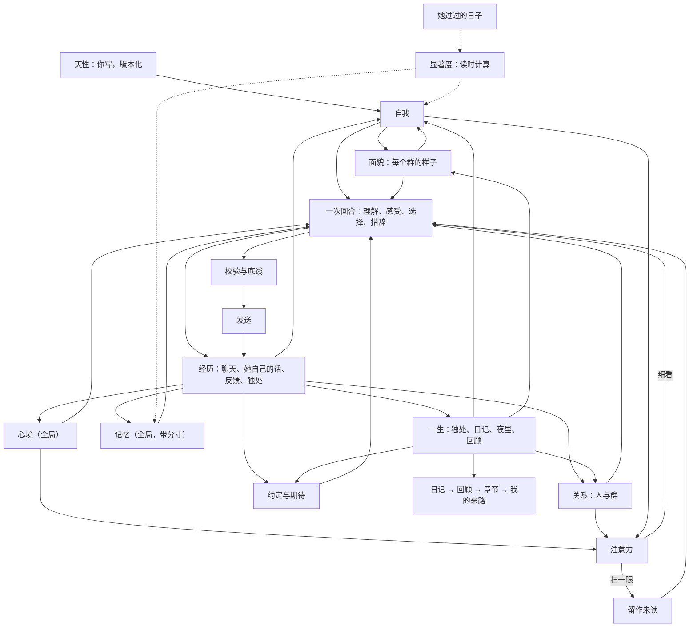

# 她的一生：统一心智的设计与使用

LuckyBot 从这一版开始不再是「按会话隔离、由概率和规则决定开不开口、人格固定不变」的机器人。所有群聊和私聊里只有一个她：她有自己的心情和精力，对每个人有感觉，在每个群有自己的样子，会在安静时独处、在睡前写日记，会重新理解过去的自己。你写下她的天性；其余的部分从经历里长出来，每一次变化都能看到来源，也都能撤销。

她不只会积累。很久没被触及的东西会从心上淡去，被相关的人或话题碰到时又会想起；久别的人会变淡，重逢时很快热络；她记得别人说过的安排和自己答应的事；每隔一段时间，她会在夜里回顾这段日子，改写自传，或者翻开新的一章。

## 已定原则

- **一个她**。会话只是「事情发生在哪里」的标注，不再是隔离墙。同一个 QQ 号在所有群和私聊里是同一个人。
- **天性是种子**。天性（名字、性格、兴趣、边界、底线、作息）是唯一由你编写的部分。自我、面貌、关系由她自己形成；你能看、能撤销，但不能替她改写。
- **由心开口**。没有参与概率、冷却抽样和「被 @ 必回」。每次细看一段对话，她都先理解这对她意味着什么，再选择说、简短反应、说不想聊或不出声，并留下自己的理由。沉默时她的心情和对人的感觉照样会变。
- **有来源、渐进、可撤销**。心智表只追加不覆盖。每条变化都引用具体经历（消息、手记、反馈、读过的段落、日记、约定）。一次经历只让强度小幅变化；新的特质要在不同的日子里反复出现才成形。撤销留下墓碑，之后的整理不会把它写回来。
- **会淡去，也会想起**。淡出是读的时候算出来的，不写任何「已淡出」标记，所以回放仍然只读过去。淡出按她经历过的日子计算（有经历的天数），不按日历：没人说话的一个月里，她不会把自己忘掉。被这批消息勾起的旧念头只是被看见，不产生写入；要重新变强，仍然要引用新的经历。撤销仍是唯一的删除。
- **注意力有代价**。扫一眼群聊不花 Token；只有真的在意时才细看。一天的 Token 有上限时，对话优先，独处和整理用各自的份额。每一类调用的输入都有上限，不随她活得多久而增长。

## 模块地图

```text
server/core/      感官与嘴：接收、聚合、感知（谁在对谁说）、语境、一次回合调用、校验、发送
server/mind/      她的心智
  nature.js       天性（版本化，唯一可编辑）、作息与「她的一天从几点开始」
  affect.js       心境：唯一的、全局的情绪与精力，由经历推动、随时间回落；「这阵子」的基线
  bonds.js        关系：对每个人、每个群的熟悉、亲近、信任、别扭；久别变淡、重逢回暖；人员目录
  self.js         自我：喜欢、看法、特质、习惯、想做的事、放在心上的事、好奇；按显著度排序与唤起
  faces.js        面貌：她在每个群的角色、说话方式、想成为的样子
  thoughts.js     手记：独处后留下的理解，修正时追加；可以放下
  memory.js       记忆：一份全局记忆，带来源和分寸（公开 / 私下 / 保密）；会淡出、可被新事实取代
  days.js         她过过的日子：每个生活日一行，淡出按这些日子计算；第几天与纪念日
  salience.js     显著度：各类内容的半衰期与阈值
  anticipations.js 约定与期待：她答应的事、她想做的事、别人的安排、每年的日子
  periods.js      回顾、自传章节与「我的来路」，每次重写都保留旧版本
  attention.js    注意力：确定性的「细看还是扫一眼」
  guard.js        底线：凭据、保密、危机
  budget.js       Token 账本与每日份额
  view.js         给每次调用的「此刻的她」（有上限的几百 Token）
  reading.js      阅读：按兴趣从共享知识库挑着读，分段读下去
  life.js         一生：醒来、独处、阅读、睡前日记、夜里、回顾、主动联系
  index.js        Mind：把上面这些连成一个人
  api.js          /api/mind/*
```



## 一次「看见」的流程

1. **接收与聚合**。短时间内的连续消息合成一批。明确的「记住，我……」当场成为记忆（凭据除外），不再等待人工审核。
2. **感知**。解析 @、引用链、点名和回复对象，得到每条消息与她的关系（叫她 / 在和别人说 / 不确定）。
3. **注意力**（不调用模型）。被叫到、私聊、危机信号一定细看。普通群聊按确定性的分数决定：刚才她还在聊、有人问大家、聊到她天性里的兴趣或自我线索、熟悉的人在说话、攒了不少消息、有一阵没看群，都会加分；只有表情和图片、明显在和别人说话会减分。精力低、Token 紧张时门槛变高；天性里的「主动」越高门槛越低。没细看的消息保留为未读，下一次细看时一起读到，所以不会因为省 Token 丢掉上下文。扫一眼也算「见到了」这些人。维护定时器每隔一阵也会回头看看安静下来的群。
4. **回忆**。一份全局记忆：先看当前说话的人和话题，别处知道的事只在相关时想起；私聊里知道的带上「私下知道，不要当众说出口」；被要求保密的事绝不进入别的会话。很久没被想起、又不太重要的记忆只在被真正聊到（两个以上的词对得上）或本人正在说话时才回来；超过一周的记忆带上「几个月前知道的」，她才知道那是旧消息。再加上知识库、分层语境摘要和阶段总结。
5. **此刻的她**。`self`（她在这里的样子、此刻最有分量的几条自我线索、最近一篇日记）放进可缓存的前缀，一天只变几次；最强的两条线索是她的核心，再安静也不会被挤掉。`inner`（醒着 / 犯困、精力、心情和原因、「这阵子」、对在场的人的感觉、放在心上的事、临近的约定、被这批消息勾起的旧念头、最近听到的反馈）放在每轮末尾。整体有几百 Token 的上限。
6. **一次回合调用**。模型一次输出：这对我意味着什么、感受、对人的变化、选择（speak / react / decline / silent）、理由、回复目标和要说的话。私聊和 @ 仍只调用一次；群里开口时比旧版少一次决策调用。
7. **经历**。无论说不说，感受写入心境，对人的变化写入关系（必须引用这批里的消息），她的选择和理由写入记录，被叫到的人和她聊过的人熟悉度增长。
8. **措辞与校验**。本地校验（重复、客服腔、刻薄、字数、简短反应要短）和保密检查；倾诉、纠正、危机或复杂的群聊回复额外复审一次（Token 紧张时跳过）；最多重写一次，仍不合格就用安全短句。
9. **发送**。发送前再检查语境是否过期、会话是否仍开启；每分钟发言轮数限制、发件箱、不确定投递不重发都保留。

回放和试聊走同一条链路，但回放只读取当时之前的心智（按时间点重建心境、关系、自我、显著度、放下的手记和结束的约定），试聊读取她此刻的心智但不写入、不发 QQ。

## 她的一天

- **作息**（天性里设置，默认 02:00 睡、08:00 醒）。睡着时不看群；被私聊或 @ 会等醒来再看；危机消息会叫醒她。睡前一小时犯困、刚醒一小时迷糊，精力随之变化。两小时内说话越多越累。她的一天从醒来算起。
- **醒来**。先读睡着时收到的直接消息，自己决定怎么回（可以自然地说「刚看到」）。
- **独处**。聊天安静一阵、积累了新的经历、距离上次足够久时，她会一次看完所有会话的近况（每个会话最近几十条、阶段总结、她自己说过的话、收到的反馈、放在心上的旧想法），留下新的理解，修正自我、面貌和对人的印象，心情也会变。她也会看到正在淡出的线索（可以放下，或者在有新经历时重新确认）、好久没见又挺在意的人（可以想起他，也可以计划联系）、在等的事（可以计划问一句结果，或者把有了结果的事结束掉），以及自己正在经历的这一章。在等的事临近或刚过去，也是安静一会儿的理由。独处期间又有了新对话时，已经想好的仍然留下（它们引用的都是之前的经历），只是不再打算在那个会话主动开口，心情也不因此改变；天性被改了，这次想法才不作数。
- **睡前日记**。一天结束时，如果真的有过经历，她会写日记，并和「昨天的她」（前一天保存的快照）对照。日记只带上「我的来路」、正在经历的这一章、今天是第几天、今天的纪念日，以及今天做到的、错过的和仍在等的事，不再带上所有章节，所以日记的输入不随她的年龄增长。她可以在日记里放下不再挂心的手记。写失败会隔几个小时再试，最多三次。
- **夜里**（天性页「夜里整理」，默认开启）。日记写完、她睡着以后（没开作息则在 03:00–06:00），每次只做一件事：先把积压了 6 条以上用户消息的会话整理进记忆和约定，消息少的私聊也不用等攒够 40 条；然后在回顾到期时回顾。
- **回顾与自传**。日记攒到两篇以后，她会在夜里第一次回顾；之后每隔「回顾间隔」天（默认 7 天，且期间至少有两篇日记）回顾一次：读这段时间的日记、这段时间自己的变化（新出现的、淡出的、变了的线索，变化最大的关系）、做到和错过的约定，写下回顾和「和上次比」。回顾时她会改写正在经历的这一章，或者觉得日子换了样子、翻开新的一章（软上限约 8 次回顾）；翻篇时重写一段不超过 600 字的「我的来路」。所有版本都保留。
- **阅读**。独处时，她会从「记忆 → 文档知识库」里的**共享**集合挑自己感兴趣的读（按天性里的兴趣和她此刻在意的线索），读完一段接着读下一段，写下一句读后的想法；读到的内容可以成为手记和自我的来源（`r:段落`）。最近读过的东西会留在她的样子里，聊天时可以自然提起。书架上还有没读的，也是隔几个小时安静一会儿的理由。私聊范围的资料不会被她读进心里；订阅源不抓取。
- **主动联系**。独处时她可以计划「过一阵想问问某人某件事」，包括好久没见的人和她在等的事。时间到了、你打开了主动联系、QQ 在线、她醒着、那段对话已经安静三小时以上、对方没说过别打扰、上一次主动的话已经有回应时，她会再完整看一次那段对话，自己决定说不说。

## 时间的重量

- **自我线索**：最后一次被经历触及之后，宽限 3 个有经历的日子，再按半衰期淡去（特质 180 天、看法与习惯 90 天、喜欢 60 天、放在心上与想做的事 30 天、好奇 21 天；证据跨 5 天以上的特质再慢一倍）。分量低于 0.12 就从心上淡出，但不会被删掉：之后再次提到时是「回来」，不会长出第二条。
- **手记**：按重要度和半衰期淡去（仍放在心上 21 天、重新理解 14 天、后来想到与久别想起 10 天）；约好的回看时间到了会重新浮上来一阵。写下修正时，旧的那条会被放下；她也可以在独处和日记里主动放下，界面上的「放下这件事」同样记下放下的时间。
- **被勾起**：这批消息里和淡出的线索、手记有两个以上词对得上时，它们会出现在 `inner.reminded`，标着「很久没想起了」。它们只在每轮末尾出现，不进可缓存的 `self`，也不写入任何东西。撤销过的永远不会被勾起。
- **记忆**：不重要（重要度低于 0.6）、没有锁定、45 个有经历的日子里没被想起的记忆，只有被真正聊到或本人在说话时才回来；最近被想起过的排得更靠前。整理记忆时会带上她已经记得的事，新事实推翻旧的（搬家、换工作、改了主意）时，旧记忆标为「已被取代」，保留版本，不再被想起。
- **关系**：超过两周没来往，亲近度会以 60 天的半衰期回落到最好时的一半（不低于初识），熟悉度以 120 天回落到最好时的六成；久别后的第一次来往会找回一半。她分得清「好久不见」（这个人好久没出现了）和「最近没怎么说上话」（这个人一直都在，只是没和她说话）；扫一眼群聊也算见到。群里的感觉同理：好久没在那里说话，她会知道。
- **这阵子**：最近两周每个生活日的心情做加权平均，让她回落到的基线在 ±0.12 内移动；好的一段日子会让她「这阵子挺开心」，难熬的一段会「这阵子有点低落」，之后慢慢回到平常。

## 约定与期待

- **从哪里来**：整理记忆时，模型按消息的本地时间把「明天」「下周三」换成日期，记下别人说的安排（考试、面试、出发、见面）、每年都会回来的日子（生日、纪念日），以及她自己答应别人的事（必须是她自己说过的话）。独处和日记里，她也可以写下自己想做、说得出日子的事。分寸跟着来源走：私聊里知道的只在那个私聊出现，被要求保密的只在原处。
- **到哪里去**：从前一天开始到之后几天，相关的人在场或事情发生在这里时，会出现在 `inner.expecting`（最多 3 条），比如「阿明：考高数（明天）」「我答应阿明：提醒他交作业（今天，还没做）」；她可以自然地问一句结果，不会播报。独处时她能看到临近、刚过去或悄悄错过的事，可以计划主动联系，或者把有了结果的事结束（做到了 / 错过了 / 不再惦记，都要有来源）。日记里会写到今天做到的、错过的和今天特别的日子。
- **错过**：过了日子还没有结果的，别人的安排宽限 3 天、她的承诺和打算宽限 7 天，之后读取时算作错过，不写入；错过的承诺会出现在那天的日记里。
- **撤销**：在「一生」页撤销一条约定会留下墓碑，之后整理记忆时不会把它写回来。

## 底线

写在天性里、你可以修改的底线：别人要求保密的事不在别处说出口；有人表达真实危机时不因自己的情绪沉默；被直接问到身份时如实回答、不编造经历；不索取陪伴、不制造亏欠。

写死在代码里的：密码、密钥、验证码之类的凭据不进入心智；被要求保密的记忆永不检索到别的会话，回复发出前还会与这些秘密比对，撞上就重写；危机信号一定会被细看，模型判断为真实危机时她必须开口。

## Token 管理

| 手段 | 作用 |
| --- | --- |
| 注意力扫一眼 | 普通群聊大多不调用模型；未读消息攒到下次细看时一起读 |
| 一次回合调用 | 理解、感受、选择和措辞一次完成；群里开口时省一次调用 |
| 内置 Prompt 只发一遍 | 未修改的系统与生成指令不重复发送；存过的旧版内置 Prompt 按新版处理，不当作自定义 |
| 记忆只取相关的 | 只取相关或关于在场的人，最多 12 条；淡出的记忆不再擦边混进来，候选只读可能相关的几行 |
| 缓存友好的布局 | 天性在系统提示，`self` 在前缀，`inner` 和本轮数据在末尾；被勾起的旧念头只进 `inner` |
| 淡出 | 显著度、久别、「这阵子」、每日汇总都在本地计算，不花 Token；淡出的线索和手记不再进入 prompt |
| 分层自传 | 日记只带「我的来路」和当前章节，回顾只带这段时间的日记，输入不随年龄增长 |
| 夜里整理 | 只对积压了消息的会话整理一次；已经记得的事不再重复写 |
| 独处不白花 | 被新对话打断的独处保留已形成的理解，读过的段落照常记为已读 |
| 复审收窄 | 只在倾诉、纠正、危机或复杂群聊时复审；预算紧张时跳过 |
| 独处合并 | 一次独处看完所有会话，每个会话只带有限的近况，而不是按会话反复调用 |
| 每日份额 | 可选的每日上限；独处、日记与回顾，记忆整理各有份额；对话优先 |
| 账本 | 每次调用按用途记账（对话 / 独处 / 整理），「她 → 此刻」可见；回顾记在独处份额里 |

## 数据

心智表都在同一个 SQLite 里：`mind_nature`（天性版本）、`mind_affect`（心境事件）、`mind_bond_events` 与 `mind_people`（关系与人员目录）、`mind_self`（自我线索的所有版本）、`mind_faces`（面貌版本）、`mind_thoughts`（手记，放下时记 `resolved_at` 与原因）、`mind_diary`、`mind_snapshots`（每天一份「那天的她」）、`mind_chapters`（自传的所有版本）、`mind_periods`（回顾与「我的来路」的所有版本）、`mind_days`（每个生活日：有没有经历、心情、看了几次、说了几次、见了几个人）、`mind_anticipations`（约定与期待及其结束）、`mind_choices`（她的选择与理由）、`mind_revocations`（墓碑）、`mind_readings`（读过的段落与读后想法）、`mind_runs`（独处、日记、夜里整理与回顾的运行）、`mind_usage`（Token 账本）、`mind_attention`（每个会话看到哪儿了）。记忆仍在 `core_memories`，增加了 `discretion` 分寸标签和 `superseded_by`。

## 界面

- **她 → 此刻**：心情、精力、作息、「这阵子」、来到这里的第几天、最近为什么说或没说、各会话的未读、这几天她在等的事、今天的 Token 花在哪、心情是怎样变过来的；可以手动让她独处或写日记。
- **她 → 自我**：按类型排列的线索、强度与此刻的分量、是否刚形成、哪几条是她的核心、哪些在慢慢淡出、最近一次被触及的时间、有几天的经历、每个版本、撤销；淡出的线索单独列出。
- **她 → 关系**：她认识的人（在哪都是同一个人）、认识多久、上次说上话和上次见到的时间、每种感觉是怎么来的（可撤销）、她在每个群的样子和变化历史。
- **她 → 一生**：日记与「和昨天的自己比」、那天的她（多了什么、变了什么、放下了什么）、自传章节与「我的来路」（含旧版本）、她的回顾、约定与期待（来源、结果、撤销）、她读过的、手记（放下的原因）、独处、日记、夜里整理与回顾的运行记录。
- **她 → 天性**：唯一可编辑的部分；她怎样度过没人说话的时间（独处、读资料、睡前日记、夜里整理、主动联系、回顾间隔）；每日 Token 与份额；高级 Prompt；右侧是走真实链路的试聊。
- **对话 → 会话设置** 只保留物理设置：模型、视觉、聚合窗口、上下文、字数、记忆与压缩开关。
- **记忆** 页：她记得的事（来源、把握、分寸），可修改分寸、锁定、撤销；文档知识库不变。

## 升级

第一次启动新版本时会自动迁移：旧的全局人设和人格页设置成为天性第一版；会话里的「群人格覆盖」成为她在那个群的第一个面貌；旧的时间手记成为手记，最近一次内在状态成为心境的起点；把握较高的自动整理候选直接成为记忆，待审核的「记住」请求也直接记住；旧的时间设置迁移到她的日子和每日上限。概率、冷却和主动安慰开关不再使用。迁移前建议 `npm run backup`。

之后的升级只增加表和列：已有的章节保留，第一次回顾会从最新一章接着写；「她过过的日子」从升级后的第一个生活日开始回补最近 14 天，所以升级前的线索不会一下子全部淡出。

## 验证

- `npm test`：包括心智各部分的单元测试、一生（独处、日记、夜里回顾、自传、主动联系、作息）测试，三天、两个群加一个私聊的确定性「一生模拟」，以及 120 天的「长一生模拟」。三天模拟验证：同样的经历两次得到同样的她、意愿路径里没有随机数、她说过的话成为证据、变化有来源且渐进、撤销的不会回来、心情会回落、同一个人在各群一致、秘密不外泄（即使模型说漏）、危机底线有效、夜里的消息醒来再回、每天的日记与昨天对照、夜里回顾写下第一章、回放不读未来。长一生模拟验证：不再被强化的线索和手记会淡出，相关话题出现时被勾起、不写入、不改变 `self`，撤销的永远不会被勾起；安静的一个月里线索不淡出；核心线索一直在；私聊里听到的考试前一天出现在那个私聊的 `inner.expecting`，不进群，考完后被结束；错过的承诺出现在那天的日记里；搬家的新事实取代旧的，久没提的小事只在本人说话时想起；久别的人变淡、被认出「好久不见」、重逢后回暖，而天天在群里见到的人不会被当成久别；好的一周让「这阵子」上扬又回落；回顾会翻篇、「我的来路」只在翻篇时重写；第 120 天时回合、独处、日记、回顾的输入仍在上限内；回看第十天只看到那时的她。设置 `LIFE_DAYS=365` 可以跑满一整年。
- `npm run test:ui`：Studio 冒烟测试与「她」工作台的浏览器测试。
- `node scripts/evaluate-life.js`：用你保存的模型真实过几天（会消耗 Token），输出 `data/evaluations/life-*.md` 供逐条阅读；加 `--weeks 3` 会在之后压缩地再过三周普通日子（有人说起考试、有人消失又回来），报告里有她在等的事、被勾起的念头、回顾、章节、「我的来路」和淡出的线索，消耗的 Token 会多得多；`--mock` 只检查脚本本身。

## 代价与限制

- 普通群聊的反应由注意力分数决定，偶尔会错过一句本可以接的话——这也是人的样子；觉得太安静，可以提高天性里的「主动」。
- 独处、日记、夜里整理和回顾会增加后台 Token；可以关闭，或用每日份额限制。
- 她在一个群听到的事，可能在另一个相关的群里提起；拦着的只有「私下知道」的分寸、保密请求和凭据。
- 淡出的半衰期和阈值是固定的常数（`server/mind/salience.js`），不在界面上调；它们只决定什么此刻在她心上，从不删除任何东西。
- 约定只在整理记忆时提取：白天积压不到 40 条的会话会在当晚整理，所以当天下午说的「明天」通常能赶上，几分钟后就要发生的事可能来不及。
- 工程能保证的是结构：连续、有来源、可修正、由她自己决定。她是否「真的有心」无法用测试验收；这些测试检验的是这些行为有没有真的发生。
