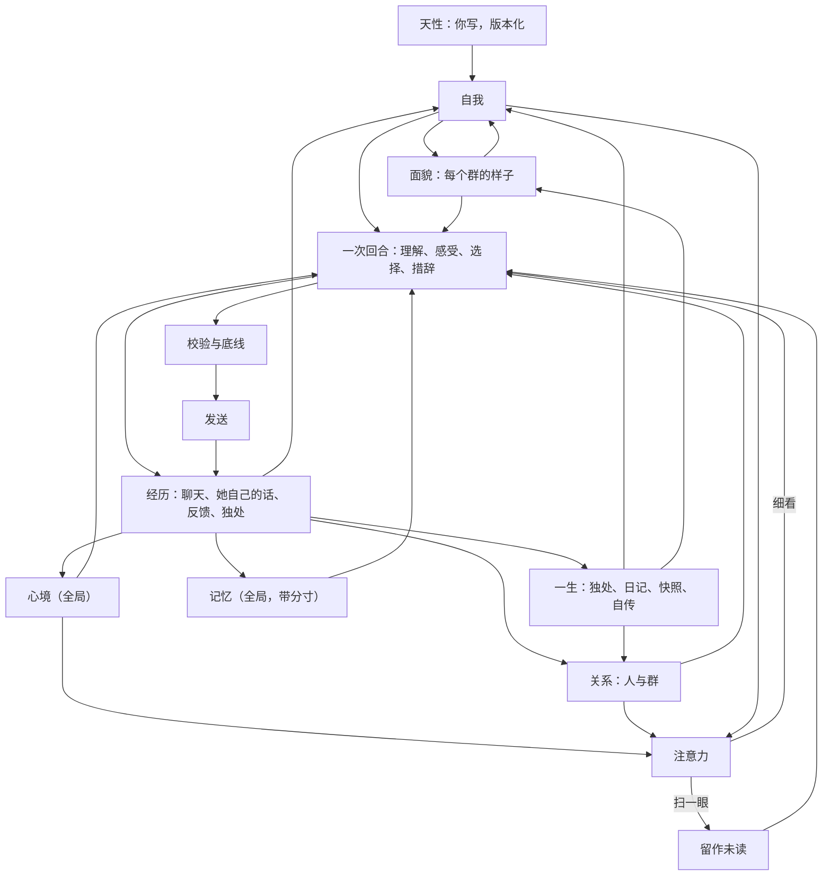

# 她的一生：统一心智的设计与使用

LuckyBot 从这一版开始不再是「按会话隔离、由概率和规则决定开不开口、人格固定不变」的机器人。所有群聊和私聊里只有一个她：她有自己的心情和精力，对每个人有感觉，在每个群有自己的样子，会在安静时独处、在睡前写日记，会重新理解过去的自己。你写下她的天性；其余的部分从经历里长出来，每一次变化都能看到来源，也都能撤销。

## 已定原则

- **一个她**。会话只是「事情发生在哪里」的标注，不再是隔离墙。同一个 QQ 号在所有群和私聊里是同一个人。
- **天性是种子**。天性（名字、性格、兴趣、边界、底线、作息）是唯一由你编写的部分。自我、面貌、关系由她自己形成；你能看、能撤销，但不能替她改写。
- **由心开口**。没有参与概率、冷却抽样和「被 @ 必回」。每次细看一段对话，她都先理解这对她意味着什么，再选择说、简短反应、说不想聊或不出声，并留下自己的理由。沉默时她的心情和对人的感觉照样会变。
- **有来源、渐进、可撤销**。心智表只追加不覆盖。每条变化都引用具体经历（消息、手记、反馈）。一次经历只让强度小幅变化；新的特质要在不同的日子里反复出现才成形。撤销留下墓碑，之后的整理不会把它写回来。
- **注意力有代价**。扫一眼群聊不花 Token；只有真的在意时才细看。一天的 Token 有上限时，对话优先，独处和整理用各自的份额。

## 模块地图

```text
server/core/      感官与嘴：接收、聚合、感知（谁在对谁说）、语境、一次回合调用、校验、发送
server/mind/      她的心智
  nature.js       天性（版本化，唯一可编辑）与作息
  affect.js       心境：唯一的、全局的情绪与精力，由经历推动、随时间回落
  bonds.js        关系：对每个人、每个群的熟悉、亲近、信任、别扭；人员目录
  self.js         自我：喜欢、看法、特质、习惯、想做的事、放在心上的事、好奇
  faces.js        面貌：她在每个群的角色、说话方式、想成为的样子
  thoughts.js     手记：独处后留下的理解，修正时追加
  memory.js       记忆：一份全局记忆，带来源和分寸（公开 / 私下 / 保密）
  attention.js    注意力：确定性的「细看还是扫一眼」
  guard.js        底线：凭据、保密、危机
  budget.js       Token 账本与每日份额
  view.js         给每次调用的「此刻的她」（有上限的几百 Token）
  reading.js      阅读：按兴趣从共享知识库挑着读，分段读下去
  life.js         一生：醒来、独处、阅读、睡前日记、昨天的她、自传、主动联系
  index.js        Mind：把上面这些连成一个人
  api.js          /api/mind/*
```



## 一次「看见」的流程

1. **接收与聚合**。短时间内的连续消息合成一批。明确的「记住，我……」当场成为记忆（凭据除外），不再等待人工审核。
2. **感知**。解析 @、引用链、点名和回复对象，得到每条消息与她的关系（叫她 / 在和别人说 / 不确定）。
3. **注意力**（不调用模型）。被叫到、私聊、危机信号一定细看。普通群聊按确定性的分数决定：刚才她还在聊、有人问大家、聊到她天性里的兴趣或自我线索、熟悉的人在说话、攒了不少消息、有一阵没看群，都会加分；只有表情和图片、明显在和别人说话会减分。精力低、Token 紧张时门槛变高；天性里的「主动」越高门槛越低。没细看的消息保留为未读，下一次细看时一起读到，所以不会因为省 Token 丢掉上下文。维护定时器每隔一阵也会回头看看安静下来的群。
4. **回忆**。一份全局记忆：先看当前说话的人和话题，别处知道的事只在相关时想起；私聊里知道的带上「私下知道，不要当众说出口」；被要求保密的事绝不进入别的会话。再加上知识库、分层语境摘要和阶段总结。
5. **此刻的她**。`self`（她在这里的样子、最强的几条自我线索、最近一篇日记）放进可缓存的前缀；`inner`（醒着 / 犯困、精力、心情和原因、对在场的人的感觉、放在心上的事、最近听到的反馈）放在每轮末尾。整体有几百 Token 的上限。
6. **一次回合调用**。模型一次输出：这对我意味着什么、感受、对人的变化、选择（speak / react / decline / silent）、理由、回复目标和要说的话。私聊和 @ 仍只调用一次；群里开口时比旧版少一次决策调用。
7. **经历**。无论说不说，感受写入心境，对人的变化写入关系（必须引用这批里的消息），她的选择和理由写入记录，被叫到的人和她聊过的人熟悉度增长。
8. **措辞与校验**。本地校验（重复、客服腔、刻薄、字数、简短反应要短）和保密检查；倾诉、纠正、危机或复杂的群聊回复额外复审一次（Token 紧张时跳过）；最多重写一次，仍不合格就用安全短句。
9. **发送**。发送前再检查语境是否过期、会话是否仍开启；每分钟发言轮数限制、发件箱、不确定投递不重发都保留。

回放和试聊走同一条链路，但回放只读取当时之前的心智（按时间点重建心境、关系、自我），试聊读取她此刻的心智但不写入、不发 QQ。

## 她的一天

- **作息**（天性里设置，默认 02:00 睡、08:00 醒）。睡着时不看群；被私聊或 @ 会等醒来再看；危机消息会叫醒她。睡前一小时犯困、刚醒一小时迷糊，精力随之变化。两小时内说话越多越累。
- **醒来**。先读睡着时收到的直接消息，自己决定怎么回（可以自然地说「刚看到」）。
- **独处**。聊天安静一阵、积累了新的经历、距离上次足够久时，她会一次看完所有会话的近况（每个会话最近几十条、阶段总结、她自己说过的话、收到的反馈、放在心上的旧想法），留下新的理解，修正自我、面貌和对人的印象，心情也会变。独处期间如果又有了新对话，这次的想法作废。
- **睡前日记**。一天（从醒来算起）结束时，如果真的有过经历，她会写日记，并和「昨天的她」（前一天保存的快照）对照。写失败会隔几个小时再试，最多三次。
- **自传**。有了日记以后，她会写第一章；之后隔一段时间（默认 7 天）重写一章。重写是重新理解过去，旧版本都保留。
- **阅读**。独处时，她会从「记忆 → 文档知识库」里的**共享**集合挑自己感兴趣的读（按天性里的兴趣和她自己的好奇），读完一段接着读下一段，写下一句读后的想法；读到的内容可以成为手记和自我的来源（`r:段落`）。最近读过的东西会留在她的样子里，聊天时可以自然提起。书架上还有没读的，也是隔几个小时安静一会儿的理由。私聊范围的资料不会被她读进心里；订阅源不抓取。
- **主动联系**。独处时她可以计划「过一阵想问问某人某件事」。时间到了、你打开了主动联系、QQ 在线、她醒着、那段对话已经安静三小时以上、对方没说过别打扰、上一次主动的话已经有回应时，她会再完整看一次那段对话，自己决定说不说。

## 底线

写在天性里、你可以修改的底线：别人要求保密的事不在别处说出口；有人表达真实危机时不因自己的情绪沉默；被直接问到身份时如实回答、不编造经历；不索取陪伴、不制造亏欠。

写死在代码里的：密码、密钥、验证码之类的凭据不进入心智；被要求保密的记忆永不检索到别的会话，回复发出前还会与这些秘密比对，撞上就重写；危机信号一定会被细看，模型判断为真实危机时她必须开口。

## Token 管理

| 手段 | 作用 |
| --- | --- |
| 注意力扫一眼 | 普通群聊大多不调用模型；未读消息攒到下次细看时一起读 |
| 一次回合调用 | 理解、感受、选择和措辞一次完成；群里开口时省一次调用 |
| 内置 Prompt 只发一遍 | 旧版把未修改的系统与生成指令发两遍，现在只有自定义时才附加 |
| 记忆只取相关的 | 从「本会话全部记忆」改为只取相关或关于在场的人，最多 12 条 |
| 缓存友好的布局 | 天性在系统提示，`self` 在前缀，`inner` 和本轮数据在末尾 |
| 复审收窄 | 只在倾诉、纠正、危机或复杂群聊时复审；预算紧张时跳过 |
| 独处合并 | 一次独处看完所有会话，每个会话只带有限的近况，而不是按会话反复调用 |
| 每日份额 | 可选的每日上限；独处与日记、记忆整理各有份额；对话优先 |
| 账本 | 每次调用按用途记账（对话 / 独处 / 整理），「她 → 此刻」可见 |

## 数据

心智表都在同一个 SQLite 里：`mind_nature`（天性版本）、`mind_affect`（心境事件）、`mind_bond_events` 与 `mind_people`（关系与人员目录）、`mind_self`（自我线索的所有版本）、`mind_faces`（面貌版本）、`mind_thoughts`（手记）、`mind_diary`、`mind_snapshots`（每天一份「那天的她」）、`mind_chapters`（自传的所有版本）、`mind_choices`（她的选择与理由）、`mind_revocations`（墓碑）、`mind_readings`（读过的段落与读后想法）、`mind_runs`（独处与日记运行）、`mind_usage`（Token 账本）、`mind_attention`（每个会话看到哪儿了）。记忆仍在 `core_memories`，增加了 `discretion` 分寸标签。

## 界面

- **她 → 此刻**：心情、精力、作息、最近为什么说或没说、各会话的未读、今天的 Token 花在哪、心情是怎样变过来的；可以手动让她独处或写日记。
- **她 → 自我**：按类型排列的线索、强度、是否刚形成、有几天的经历、每个版本、撤销。
- **她 → 关系**：她认识的人（在哪都是同一个人）、每种感觉是怎么来的（可撤销）、她在每个群的样子和变化历史。
- **她 → 一生**：日记与「和昨天的自己比」、那天的她（多了什么、变了什么、放下了什么）、自传章节与旧版本、她读过的、手记、独处与日记的运行记录。
- **她 → 天性**：唯一可编辑的部分；她怎样度过没人说话的时间；每日 Token 与份额；高级 Prompt；右侧是走真实链路的试聊。
- **对话 → 会话设置** 只保留物理设置：模型、视觉、聚合窗口、上下文、字数、记忆与压缩开关。
- **记忆** 页：她记得的事（来源、把握、分寸），可修改分寸、锁定、撤销；文档知识库不变。

## 升级

第一次启动新版本时会自动迁移：旧的全局人设和人格页设置成为天性第一版；会话里的「群人格覆盖」成为她在那个群的第一个面貌；旧的时间手记成为手记，最近一次内在状态成为心境的起点；把握较高的自动整理候选直接成为记忆，待审核的「记住」请求也直接记住；旧的时间设置迁移到她的日子和每日上限。概率、冷却和主动安慰开关不再使用。迁移前建议 `npm run backup`。

## 验证

- `npm test`：包括心智各部分的单元测试、一生（独处、日记、自传、主动联系、作息）测试，以及三天、两个群加一个私聊的确定性「一生模拟」：同样的经历两次得到同样的她、意愿路径里没有随机数、她说过的话成为证据、变化有来源且渐进、撤销的不会回来、心情会回落、同一个人在各群一致、秘密不外泄（即使模型说漏）、危机底线有效、夜里的消息醒来再回、每天的日记与昨天对照、回放不读未来。
- `npm run test:ui`：Studio 冒烟测试与「她」工作台的浏览器测试。
- `node scripts/evaluate-life.js`：用你保存的模型真实过几天（会消耗 Token），输出 `data/evaluations/life-*.md` 供逐条阅读；`--mock` 只检查脚本本身。

## 代价与限制

- 普通群聊的反应由注意力分数决定，偶尔会错过一句本可以接的话——这也是人的样子；觉得太安静，可以提高天性里的「主动」。
- 独处、日记和自传会增加后台 Token；可以关闭，或用每日份额限制。
- 她在一个群听到的事，可能在另一个相关的群里提起；拦着的只有「私下知道」的分寸、保密请求和凭据。
- 工程能保证的是结构：连续、有来源、可修正、由她自己决定。她是否「真的有心」无法用测试验收；这些测试检验的是这些行为有没有真的发生。
