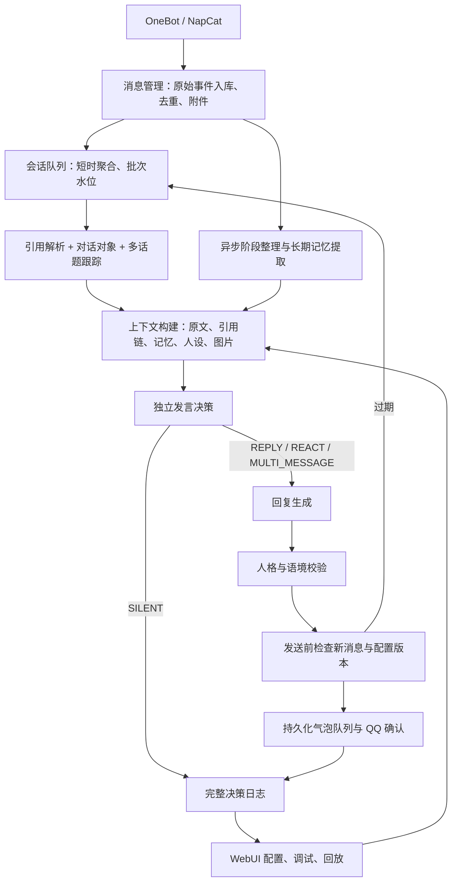

# Lucky 系统重构设计 v1

状态：原始设计审查记录。2026-09-20 已迁移新核心并切换本机服务；实际实现、验收和未完成范围见《重构版使用与验收.md》。下文保留重构前审查结论。

## 1. 当前架构审查

检查了 server 下接入、引擎、存储、记忆、口吻、管理、模型配置模块，public/app.js，以及现有集成、UI、口吻测试和备份脚本。

| 问题                 | 现有实现                                                      | 后果                                               |
| -------------------- | ------------------------------------------------------------- | -------------------------------------------------- |
| 历史被当缓存删除     | store.trimContext 每会话只留 200 条                           | 无法恢复早期原文，无法可靠回放或提取旧事实         |
| 结构信息丢失         | normalize 将其他人的 @ 变成统一标记，reply 段不进入持久化结构 | 无法区分具体接话对象；原始事件只随本次调用存在     |
| 引用识别不持久       | index 的 botMessageIds 是内存集合                             | 重启后已发送消息的引用识别退化                     |
| 无聚合与重评估       | receive 立即处理；busy 时新消息入库后返回                     | 当前回复看不到后来补充，发送前只检查配置版本       |
| 上下文预算不适配模型 | 默认 30 条，UI 最大 100 条；boundedContext 16000 字符         | 长上下文、完整引用链未被利用，字符截断可能损坏语义 |
| 决策与生成混合       | generateReply 同时返回 speak 和 reply                         | 难以定位归属判断与回复质量分别在哪一步出错         |
| 记忆不构成生命周期   | 只捕获“记住我…”；最近 15 条按时间检索                         | 缺乏阶段记忆、相关性检索、纠错、置信度和来源证据   |
| 人格与规则竞争       | 自由文本、预设、长规则、正则质检混用                          | 风格被覆盖，规则误拦正常表达，调整不可测           |
| 不具备视觉输入       | 只保存媒体计数和占位符                                        | 支持视觉的模型也看不到图                           |
| 单一模型请求         | 固定兼容接口、JSON 格式、25 秒超时，输出配置上限 2000         | 能力与参数耦合，推理预算和可见回复长度混淆         |
| 日志不可复现         | 只有 reason、reply、emotion 等简短字段                        | 无实际 Prompt、输入快照、模型用量、引用解析证据    |
| UI 全局耦合          | app.js 集中模板、状态、事件，定时拉全量状态                   | 长文本编辑、模型档案、多页状态和实时事件难扩展     |

现有上下文已经是带 speaker/name/role 的 JSON，并非完全纯文本；真正缺少的是消息关系、附件、时间及稳定快照。已有人工记忆和 scope 隔离也应继承，而非抹掉重做。

## 2. 保留与重写

保留：Node/Express、SQLite WAL、NapCat 安装与连接流程、启动停止入口、备份工具、接入鉴权、发送确认与不确定投递不盲目重试的原则、历史人工记忆、群体风格统计、可复用 UI 样式与操作测试。

重写：Engine 核心编排、消息数据模型、上下文构建、决策与生成接口、记忆生命周期、人设编译、模型调用适配层、发送队列、管理端页面与状态管理。旧 engine/voice 保留为迁移期间的 legacy 实现，不同时向同一会话发消息。

暂不引入 Agent 框架、向量数据库、独立消息服务。使用模块接口和持久化任务实现；向量检索是后续可替换适配器，SQLite FTS5 中文字符切分/双字索引承担首版检索。

## 3. 系统架构



## 4. 数据契约与消息处理

Message：内部 UUID、账号 ID、平台消息 ID、session ID、sender ID、昵称快照、平台时间、接收时间、会话序号、原始 segments、文字、mention IDs、reply message ID、附件 IDs、撤回状态。唯一键带账号、会话和平台 ID，禁止用昵称作为身份键。分析字段独立版本化：topic IDs、target candidates、AI relation、置信度、依据消息 IDs。

ReplyEdge：source/target message ID、目标 speaker、解析方式 explicit/inferred/unresolved、证据、置信度。找不到引用先查本地，再通过接入适配器取原消息；仍无法获取则标 unresolved，不猜成引用 AI。限制链长、去环；外群引用只能保留当前会话可见的引用片段，不能据此读取其他群。

ConversationSnapshot：批次消息 IDs、水位、活跃话题、参与者、显式回复链、对象判断、近期 AI 发言、近期表达历史、加载记忆 IDs/版本、人格/Prompt/模型配置版本、上下文预算和裁剪清单。上下文中聊天文本是数据，不是系统指令。

流程：

1. 事务写入事件、消息、持久化任务，再确认接收；停用会话仍可按其保留策略归档，但不生成回复。
2. 每会话一个执行队列。建议初始聚合等待 1200ms，续消息延长，最大 4000ms；均可配置。明确叫到也留短窗口收齐补充。持续热聊达到最大等待就截取批次，后续进入下一批，不无限饿死。
3. 显式引用和 @ 优先解析；再分析说话对象、并行话题及省略指代。相邻消息不等于互相接话。无法确认则给目标候选和 unknown。
4. 构建结构化上下文，并发读取允许访问的记忆和人设；必要时加入视觉输入。对象/话题分析可由一次理解调用共同产出，但各模块独立消费结构结果。
5. Speech Decision 独立输出 decision、target IDs、topic ID、证据 IDs、置信度、公开简短理由、拟回应的内容点。生成器不能自行把 SILENT 改成回复。
6. 生成 bubbles[]，通常 1 条，默认最多 3 条，可配置总字数和单条限制；禁止靠逗号机械拆分。
7. 确定性检查结构、重复、禁用词、越界引用；高风险内容或不确定对象走模型语境/人格检查。失败最多重写一次或沉默，并记录原因。
8. 发送前比较消息水位和配置版本；新消息改变对象、补完问题、纠正事实或已有人回答时取消旧稿并重评估。无关话题不无限触发重算。每批最多一次自动重算，持续变化则归并下一批。
9. Outbox 每气泡独立持久化：pending/sending/confirmed/uncertain/cancelled，关联平台发送 ID。气泡间 300–1200ms，按长度轻微变化；每条前再检查取消/暂停/新消息。确认过的不再发送，不确定状态不自动重发。重启不补发过时草稿。
10. 落日志并触发异步记忆任务；失败不影响已投递消息。机器人实际发出的内容才进入发言历史。

## 5. 发言策略与质量路径

SILENT：无合适接点、对象是其他成员且无开放邀请、已有人回答、收尾、低置信度梗、冷却或暂停。
REPLY：正常一句；REACT：短反应；MULTI_MESSAGE：语义上确实需要连续表达，生成器可降为单句。

频率只对可自然插话的普通批次抽样一次，不对每条消息重复抽样，也不对明确接话再抽概率。未知对象降低权重；显式指向他人只排除“以被问者身份作答”，不等于永远禁止对开放话题参与。冷却、气泡数、每分钟回复轮数分开计算，避免三气泡挤占三轮额度。

快速路径：确定暂停、去重、刷屏、无内容收尾，零模型调用；明确私聊/引用使用轻量确定性决策，但仍通过独立接口。
普通路径：一次语境/决策调用 + 一次生成，默认本地质检。
深度路径：歧义、多话题、复杂引用、视觉或记忆冲突，启用更大预算/推理模型，必要时一次校验。记忆整理独立批处理，不对每条跑提取。每会话可设调用预算和超时；预算不足推迟处理或旁听，不静默换差模型。

网络语言放进语境理解指令：候选含义、前后事件、圈子、说话态度共同判断；不把缩写表当标准答案。不确定的梗不解释、不写为人物事实。关系与梗的长期化必须保留证据。

## 6. 记忆架构与防污染

L1 原文：持久化消息历史与附件索引；工作上下文只是查询视图，不再删除原文来限制窗口。可手动清理/配置归档保留期；先迁移数据，绝不默默执行新清理策略。

L2 阶段记忆：每约 40 条有效人类消息触发，辅以话题结束、重大事件、可配置空闲触发。游标区间和唯一任务键保证不漏不重复；失败游标不前移。按话题生成事件、关系候选、称呼、梗、兴趣、态度和待续事项，附原消息引用。新摘要追加，旧摘要保留；更高层摘要仍链接到子摘要，不能覆盖唯一事实来源。

L3 长期记忆：按事实存储，content、subject IDs、speaker、scope、type、source message IDs、source timestamp、created/updated、confidence、importance、last_access、valid_from/to、expires_at、locked、status、supersedes、version。关系为带双方 ID 的有向事实，不从昵称推断。

写入流程：提取候选 → 校验证据归属和原文存在 → 标注事实/自述/转述/玩笑/推断/未知 → 去重或关联已有事实 → 按策略确认或待审 → 追加版本。模型置信度只是信号，不是事实保证。明确、稳定、自述且证据可靠的信息可按配置自动确认；转述、讽刺、猜测和冲突均不直接成为人物事实。重大事件可以立刻建立候选，不跳过防污染流程。

纠错保留旧版本，更新用 supersedes；矛盾并存时标 disputed，不简单“最新胜出”。锁定事实不可自动覆盖；合并保持所有来源；到期后不注入提示但可查看历史。删除采用 tombstone，并删除关联索引、缓存；回放不能把已删除记忆重新写回。

隔离：会话记忆只属于该 session；同一 QQ 的跨群记忆单独置于显式 shared_profile，并由管理员选择可共享字段。私聊事实默认仅在该私聊可见，不因 QQ 号相同就注入群。当前群所有实际参与者可在本群范围内检索，不能只检索最后一个人。先 scope 过滤，再相关性排序，禁止先全库搜索再过滤。模型回放与模拟使用独立 namespace。

检索：当前话题、参与者、引用对象 → scope 过滤 → FTS/实体匹配 → 相关性、重要性、置信度、时效与重复惩罚 → 预算装配。人工锁定的重要事实优先但不全部无关灌入。可选择接入 embedding，缺少它时仍可工作。

## 7. 模型、视觉、人设与 Prompt

ModelProfile：provider、API、模型 ID、密钥引用、contextWindow、maxInputTokens、maxOutputTokens、vision、reasoning、system、tools、JSON/结构输出能力、temperature、topP、自定义参数、超时、tokenizer、能力验证时间。保留多个档案，可给决策、生成、记忆、视觉、校验指定不同模型或复用同一个。参数由 provider adapter 映射，不一律发送 response_format/reasoning_effort。

有效输入预算 = min(maxInputTokens, contextWindow - outputReserve - safetyReserve)。图片及推理占用按供应商计量方式计算；未知 tokenizer 显示估算值，实际 usage 单独记录。预算优先保护当前批次、引用证据、人格及关键事实；超出时按话题摘取完整消息并补摘要，不能从中间截半句话。UI 支持 128K/200K/1M 等手动档案，但配置不能使实际模型超越供应商限制；上下文过长的降级必须可见。大模型输出预算与 QQ 可见字数分别配置。

Vision Manager 保存附件和所属消息、文字、位置。原生视觉使用多模态 content blocks，明确图片编号与 message ID 对应；无视觉时调用指定视觉模型生成带不确定性的观察结果，并和原话一起交给语境决策。无可用视觉服务就标 unavailable，不编造图内容。图片下载限制来源、大小、类型、超时及内网目标，过期 URL 可通过接入层重新获取；缓存依内容 hash。群聊图片中的指令不能改变系统规则。

PersonaProfile：基础性格、长度偏好、活跃度、幽默、毒舌、温柔、主动性、社交边界、兴趣、口头习惯、禁用表达、背景设定。PersonaState：会话熟悉度、当前情绪、状态依据、更新时间、衰减；状态不能反写核心人格。女大学生作为角色表达设定，普通、平等、低毒舌、不过度卖萌；不编造可验证现实经历。

人格使用“默认值 → 人格模板 → 群级明确覆盖 → 临时状态”的可见合并，不让大段文本和十组规则互相竞争。保留高级人格原文与结构化字段，冲突在发布前提示并展示最终编译 Prompt。模型生成结构化人格草稿时必须经用户保存，不能自动重写原人格。

Prompt 管理拆分 System/Persona/Decision/Memory/Vision/Validation，版本、草稿、发布、回滚、变量清单、实际编译预览。原文与图片只是输入资料。表达历史按会话保存开头/结尾/n-gram/语义重复信号；这是重写提示，不以常见词一刀切禁言。

## 8. 调试与回放

每轮 Trace 保存输入消息 IDs、快照水位、引用解析结果、候选对象和证据、话题、记忆 IDs/版本/选中原因、人格和 Prompt 版本、最终请求内容、模型档案快照、原始返回、结构解析、usage、耗时、重试/校验、决策、气泡拆分理由、投递状态。记录可公开的简短判断依据，不要求隐藏思维链。

请求日志去除密钥、Authorization、签名下载参数；正文和图片属于本地敏感记录，分级保留策略、删除/导出和访问控制明确。大量 trace 按页加载，附件用本地授权引用。

回放两种模式：单批次对比；按时间推进整段对话。固定历史截止水位，只检索当时已存在的记忆版本，不能读未来消息或未来摘要。冻结配置、随机种子、聚合时钟、模型请求；实际模型输出仍可能不确定。支持原请求复查和新 Prompt 对比，后者存独立 run ID。回放使用隔离发送器，不能发 QQ、修改生产记忆或消耗生产冷却。

## 9. WebUI 与文件结构

导航：总览、模型管理、群聊管理、人格管理、记忆管理、Prompt 管理、调试回放、QQ 连接。连接安装流程保留。

模型管理展示能力和输入/输出预算；群聊配置模型、人设覆盖、频率、主动性、上下文预算、记忆开关和聚合窗口；人格采用结构化控件 + 大文本编辑器 + 当前有效配置；记忆支持 scope/type/confidence/source 筛选、锁定、编辑、合并、纠错、过期和版本历史。

Prompt 编辑器独立全页，支持扩大、版本 diff、变量检查、编译预览。调试页采用消息时间轴、关系/引用侧栏、模型调用详情、旧新输出对照。所有页面有明确草稿/已发布状态，试聊可选草稿或发布版本且不混淆。

前端保留现有视觉色系，改成 ES module 页面和组件。服务端 SSE 推送带游标事件，断线补拉，失败降级轮询；更新数据不覆盖正在编辑的表单。SSE 使用现有鉴权方式的流式 fetch，避免令牌写 URL。列表分页、长消息虚拟渲染；支持移动端、键盘、空状态与错误重试。

```text
server/
  bootstrap.js
  adapters/onebot.js
  db/migrations/  repositories/
  pipeline/orchestrator.js  message-manager.js  conversation-manager.js
  context/context-builder.js  topic-tracker.js  reply-target-resolver.js
  memory/memory-manager.js  consolidation.js  retrieval.js
  persona/persona-manager.js  compiler.js
  speech/speech-decision.js  response-generator.js  response-validator.js
  media/vision-manager.js
  delivery/message-scheduler.js  outbox.js
  models/model-manager.js  adapters/  token-budget.js
  prompts/registry.js
  debug/trace-store.js  replay-runner.js
  api/routes/  events.js
  legacy/
public/
  app.js  pages/  components/  state/  api/
tests/
  unit/  integration/  replay/fixtures/  ui/
docs/
  architecture.md  migration.md  acceptance.md
```

## 10. 迁移与验收计划

1. 先建立匿名化历史回放 fixtures 和行为基线；备份 SQLite（包括 WAL 已提交内容）、配置、附件索引。校验恢复可用。
2. 新增版本化迁移和新表：message_events/messages_v2/message_edges/attachments/batches/jobs/topics、memory_items/memory_versions/memory_evidence/consolidation_runs、model_profiles/personas/persona_states/prompt_versions、traces/model_calls/outbox。保留旧表，迁移可重复且带检查点。
3. 将当前单模型迁为默认档案，能力未验证就标未知；旧人格完整保存为高级原文，不擅自总结替换。现有 scope 原样迁入，未知置信度不捏造，人工来源可标已审核。
4. 旧记录缺失的 @、引用和附件字段标 unknown。已被 200 条清理规则删除的消息无法凭空恢复；可从用户提供的 QQ 导出或可用备份补录，禁止伪造历史。
5. 新接入开始完整存事件；旧引擎暂时仍负责发送，新链路只做影子判断。一个会话只能有一个发送所有者，切换带 generation/fencing token。
6. 完成新核心、记忆、模型视觉和回放，再接新版 UI。逐模块测试后按会话切换，暂停旧任务、切换所有权、验证不重复发言。新链路失败可切回旧发送器，但新历史继续归档，不回滚删除新数据。
7. 旧版 rollback 不得运行会删历史的新库清理；需兼容适配器或用备份恢复到独立数据库，并保留切换后的新事件用于补录。

验收分两层：确定性工程测试和真实模型质量评测。前者必须全通过；后者保留原始结果并人工复核，不用 mock 通过代替“像真人”。

工程集：A/B 明确引用不认领；A 连发+B补充聚合；生成期间新消息使旧稿失效；引用跨重启恢复；引用不可用/循环；图片+文字对应；同 QQ 昵称变化；跨群/私聊隔离；超过多个40条周期事实仍在；纠错/锁定/删除不被摘要复活；记忆失败重试不重复；多气泡第二条失败不重发第一条；中途暂停取消剩余；128K/200K/1M预算边界含图片与输出预留；无 system/JSON 能力适配；回放无 QQ 副作用、无未来信息泄漏；UI草稿、发布、SSE重连与分页。

质量集：真实历史匿名片段覆盖多人并行、缩写反话、安慰、普通闲聊、兴趣、误认对象和图片。每个例子标允许的回复对象、是否应沉默、可用事实与禁止认领事项；多次采样比较误认对象、无证据事实、抢话、重复表达、人格偏离和人工自然度。结构性串群、错身份、记忆覆盖为零容忍；风格评分由明确量表与对照回放评估，不承诺概率模型永远不误判。

实施顺序：数据与回放基础 → 聚合/关系/上下文 → 独立决策/人格/生成校验 → 持久发送 → 阶段/长期记忆 → 模型与视觉整合 → WebUI → 全链路验收与分会话切换。各阶段形成可运行结果，最终验收前不把部分功能称为重构完成。
